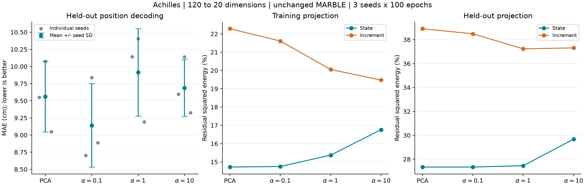

# MARBLE 状态＋增量投影：实验结果

2026-09-30 扩展验证：α=0.1 未在新增三只大鼠上复现平均 MAE 收益，
跨个体一致性平均 R² 也下降。下文为 Achilles 探索结果，不应单独用于泛化结论；
见 [四动物扩展报告](MARBLE_MULTIRAT_RESULTS.md)。

**低权重 α=0.1 在本轮对照中改善了位置解码；预先指定的主实验 α=1 没有改善
MAE。训练增量保真性质成立，但不能据此推导行为解码必然更好。**

## 实验与结果

复用现有 uv 环境：Python 3.12.10、PyTorch 2.14.0+cu130、CUDA 13、
RTX 5070 Ti Laptop GPU。未重装或更新依赖。原代码 CPU 环境负责图、采样和审计，
全部神经网络训练在 GPU 上完成。

同一只 Achilles 大鼠，120→20 维，前 8000 bins 训练、后 2000 bins 测试；
差分后分别 7999/1999 个节点。仅替换前置投影，保持 MARBLE 440→64→32 网络、
SGD、100 轮训练和余弦 kNN(k=36) 解码。每组独立训练种子 0、1、2。
α=1 是运行前确定的主实验，α=0.1、10 是敏感性检查，没有按测试结果选 α 后再
宣称确认性结果。完整方案见 [运行前方案](MARBLE_DYNAMICS_PROJECTION.md)。

主评估冻结 BN。MAE 越低越好，R² 越高越好；± 是三个训练种子的样本标准差，
并非置信区间。

| 前置投影 | MAE（cm，均值±SD） | 平均 R² | 相对本轮 PCA 的 MAE 变化 |
|---|---:|---:|---:|
| 精确 PCA，α=0 | 9.5586 ± 0.5136 | 0.88885 | — |
| 联合投影，α=0.1 | **9.1416 ± 0.6085** | **0.89867** | **−4.36%** |
| 联合投影，α=1（主实验） | 9.9135 ± 0.6365 | 0.89077 | +3.71% |
| 联合投影，α=10 | 9.6866 ± 0.4141 | 0.88867 | +1.34% |

| 种子 | PCA | α=0.1 | α=1 | α=10 |
|---|---:|---:|---:|---:|
| 0 | 9.5498 | 8.7023 | 10.1427 | 9.5946 |
| 1 | 10.0765 | 9.8362 | 10.4038 | 10.1390 |
| 2 | 9.0495 | 8.8864 | 9.1942 | 9.3263 |

低权重的三个种子都低于本轮 PCA；主实验和高权重的三个种子都高于本轮 PCA。
三种子是同一数据集上的训练重复，不能当成三只独立动物。



## 替换的数学目标

以下向量均为列向量。训练神经状态为 \(r_t\in\mathbb R^{120}\)，
训练均值为 \(\mu\)，增量 \(s_t=r_{t+1}-r_t\)。选取
\(U\in\mathbb R^{120\times20}\)，满足 \(U^\top U=I\)。

\[
C_0=\sum_t(r_t-\mu)(r_t-\mu)^\top,\qquad
C_1=\sum_t s_ts_t^\top.
\]

\[
A(U)=\sum_t\|(I-UU^\top)(r_t-\mu)\|_2^2,\qquad
B(U)=\sum_t\|(I-UU^\top)s_t\|_2^2.
\]

\[
\min_{U^\top U=I}\frac{A(U)}{\operatorname{tr}C_0}
+\alpha\frac{B(U)}{\operatorname{tr}C_1}.
\]

全局最优子空间由
\(C_0/\operatorname{tr}C_0+\alpha C_1/\operatorname{tr}C_1\)
的前 20 个特征向量张成。使用 float64 精确对称特征分解，不做迭代优化。
α 是无量纲权重；对应未归一化目标 A+λB 的
\(\lambda=\alpha\operatorname{tr}(C_0)/\operatorname{tr}(C_1)\)，
本数据的比例约为 277.0185。

所有条件均只在训练段拟合均值、能量和基。增量不再次中心化，不使用行为标签。
各解用正交 Procrustes 在选定子空间内对齐到同一 PCA 基；不改变投影算子
\(UU^\top\) 或目标值，也不做白化。此处更换的是线性子空间选择准则。

令 U₀ 为精确 PCA 解、Uα 为正权重解。PCA 的最优性给出 A(Uα)≥A(U₀)；
联合目标最优性给出 A(Uα)+λB(Uα)≤A(U₀)+λB(U₀)，故 B(Uα)≤B(U₀)。
一般地，随 α 增加，训练状态残差不减、训练增量残差不增。
该结论只涉及拟合数据和投影目标，不涉及测试泛化或解码器。

## 真实数据上的投影残差

下表均为“残差平方和 / 对应原始能量”的百分比。测试状态以训练均值中心化，
测试段未重新拟合；每个投影只有一组确定性残差，不对三个网络种子重复计数。

| α | 训练状态残差 | 训练增量残差 | 测试状态残差 | 测试增量残差 |
|---|---:|---:|---:|---:|
| 0 | 14.7163% | 22.2816% | 27.3422% | 38.9172% |
| 0.1 | 14.7466% | 21.6084% | 27.3445% | 38.4919% |
| 1 | 15.3688% | 20.0530% | 27.4547% | 37.2322% |
| 10 | 16.7610% | 19.4719% | 29.6801% | 37.3131% |

训练段与数学结论一致。主实验的训练增量残差下降约 10%，测试增量残差也下降，
但 MAE 上升。测试增量残差在 α=10 时又略高于 α=1，因此测试残差也没有训练
残差的单调保证。保留更多增量能量还不足以确定一个更好的行为相关表示。

## 与历史基线的关系

此前随机近似 PCA 的三种子结果为 9.1837±0.1867 cm；本轮最小均值 9.1416 cm
仅比它低约 0.0421 cm（0.46%）。尚不能据此声称稳定超越旧方案。

本轮为验证闭式理论，重新运行了精确 PCA；同时固定了坐标方向约定。旧版 PCA
存在方向差异，作最佳正交对齐后，训练坐标相对 Frobenius 差异仍约为 1.98%。
因此旧结果作为旁证，本轮四组为主要受控比较；不将两轮差异归因于单一因素。

## 实现与核对

- 312 项全套 pytest 通过；新增测试覆盖全 SVD 的 PCA 对齐、全局目标值、
  随权重变化的训练误差关系、训练/测试分离、差分与投影交换、单位缩放不变性。
- 新增 Python 文件通过 Ruff check 和 format check。首次全套测试遇到本机
  Tk/Tcl 绘图后端配置问题，切换已有协议要求的 Agg 后全部通过；没有改模型
  或放宽测试。其余 53 条警告来自已有依赖的弃用等提示。
- 四组各自通过原代码三步 SGD 的特征、表示、损失和参数数值核对。
- 12 个训练 checkpoint 均通过原代码回读；表示最大绝对误差
  \(4.3214\times10^{-7}\)。α=1、seed=1 的一个测试样本存在已证明的等距
  kNN 边界选择差异，预测差异为 0.00086534 m，沿用已有严格边界审计处理。
- 四组同种子初始权重、训练图验证划分一致；训练均值、PCA 参照残差一致。
  改变投影后均按原算法重建图并导出新的采样计划。
- 原始 MARBLE 仓库未修改；新实现位于分支 `codex/marble-dynamics-pca`。
  运行结束阶段仅整理导入顺序、删除无用循环变量并显式检查 zip 长度；运行时
  源码快照及其哈希已保存，投影数学实现未更改。

可复查文件：

- [12 次训练的逐种子 CSV](reports/marble-dynamics-projection-20260929/results.csv)
- [完整统计与投影诊断](reports/marble-dynamics-projection-20260929/summary.json)
- [核对汇总](reports/marble-dynamics-projection-20260929/verification.json)
- [运行时源码快照](reports/marble-dynamics-projection-20260929/executed_sources.zip)
- [原始实验目录](../results/dynamics-projection-20260929/)：权重、图、采样、日志与逐组出处。

在 KAIR 根目录重跑，选择一个不存在的输出目录：

```powershell
uv run --locked python -m scripts.marble.run_dynamics_projection --output results/dynamics-projection-new
```

范围：单只大鼠、一次时间留出、离线整段测试图。仍保留作者 spike-bin 时间单位和
非零 bin 视为事件的处理。未声称跨个体改善、在线预测或生理因果机制。

## Material Passport

- Origin Skill: academic-research-suite / experiment-agent
- Origin Mode: validate
- Origin Date: 2026-09-29
- Verification Status: ANALYZED（已做原代码数值核对；未独立重复整套 12 次训练）
- Version Label: dynamics_projection_result_v1
- 统计解释检查：11/11 类已检查。单个体不作总体推断；无混杂分层或生理因果
  推断，不涉及诊断基率；未按极端个体筛选，12 次均完整保留。固定主实验并报告
  所有敏感性条件，不做显著性检验；该探索不属于正式注册的确认性实验。
