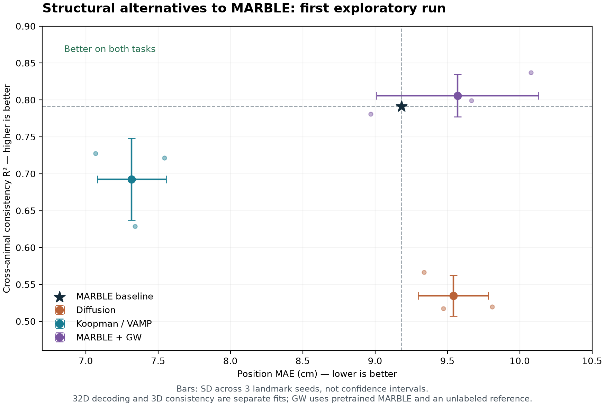

# MARBLE：三个数学模型分支的首轮结果

## Material Passport

- 实验 ID：MARBLE-MATH-20260928；状态：三个方向均完成拟合与评估。
- 基线提交：`04ed0e1`；执行：Windows、RTX 5070 Ti Laptop、官方 PyTorch
  `2.14.0+cu130`、CUDA 13、uv 锁定环境。
- 范围：Achilles 位置解码、四动物表征一致性；不是全论文复现完成声明。
- 方案在候选模型评估前写入 [固定协议](MARBLE_MATH_PROTOCOL.md)，
  源码、输入、基线、输出的 SHA-256 记录于报告。所有候选先拟合，再统一评估。
- 解释性质：已观察过的留出集上的探索结果，没有独立确认样本或显著性结论。

## 结论

**Koopman/VAMP 最值得继续研究：位置误差下降约 20.3%，三个种子均改善；
但它尚未解决跨动物一致性。没有任何候选在本轮同时超过两项基线。**
这里改变了表征的数学定义或跨域对应关系，不是学习率、网络宽度等调参。
这些构造基于已有数学理论，结果不能证明提出了原创或“颠覆性”理论。

| 方法 / 分支 | MAE，cm ↓ | 四动物一致性 R² ↑ | 本轮证据 |
| --- | ---: | ---: | --- |
| MARBLE 基线 | 9.1837 ± 0.1867 | 0.791400 | 32D 三训练种子；3D 一套作者权重 |
| `codex/marble-explore-diffusion` | 9.5405 ± 0.2437 | 0.534471 ± 0.027633 | 两项均未改善 |
| `codex/marble-explore-koopman` | **7.3176 ± 0.2389** | 0.692565 ± 0.055441 | 解码改善，一致性下降 |
| `codex/marble-explore-transport` | 9.5713 ± 0.5600 | **0.805839 ± 0.028679** | 平均一致性略升，解码退步 |

“±”为三个种子的样本标准差，不是置信区间。候选种子控制 landmarks，
不能等同于三个独立动物。GW 的 seed-0 解码是参考恒等映射，实际只有另外
两个种子检验解码变换；二者都退步。GW 的一致性只有两个种子高于基线。

## 三个方向分别改变了什么

**Diffusion：从局部距离恢复内在几何。** 在神经状态与速度构成的相空间上，
建立密度校正的扩散算子，以谱坐标代替 MARBLE 神经网络表征。核心假设是
流形邻近关系足以刻画共享结构。本轮固定实现不支持其直接替代 MARBLE；
这不等于排除所有流形方法，方向信息、地标近似和相空间度量都仍可能影响结果。

**Koopman/VAMP：从时间演化学习可预测坐标。** 用白化的时滞协方差算子做
奇异值分解，在非线性核字典里寻找具有可预测性的观测函数。它把学习目标从
静态邻近结构转向动力学可预测性。32D 解码改善支持继续调查，但目前不能把
改善完全归因于动力学目标：还需要相同核字典的静态基线及打乱时间配对的消融。
独立动物拟合的 3D 奇异子空间未必保留相同信息；需要检查谱退化、行为信息
截断，以及跨动物共同算子的可辨识性，而非直接增加调参次数。

**Gromov–Wasserstein：用关系几何学习对应。** 在已经学到的 MARBLE 表征上，
匹配两个空间内部的距离关系，再用运输重心位移映射新样本。它不要求已知神经元
对应，却额外使用无标签的参考动物/参考种子表征，因此不是同条件的独立编码器。
一致性平均提高 0.014439，但解码误差增加 0.387617 cm；这可能涉及几何对齐与
细节保留之间的取舍，不能据此断言匹配到了真实神经机制或普适对应关系。

## 逐种子完整结果

| 方法 | seed | MAE cm | 相对配对基线变化 cm ↓ | 一致性 R² |
| --- | ---: | ---: | ---: | ---: |
| Diffusion | 0 | 9.473126 | +0.502889 | 0.517490 |
| Diffusion | 1 | 9.337559 | +0.073475 | 0.566357 |
| Diffusion | 2 | 9.810704 | +0.494023 | 0.519567 |
| Koopman | 0 | 7.067814 | -1.902422 | 0.727514 |
| Koopman | 1 | 7.341121 | -1.922962 | 0.628640 |
| Koopman | 2 | 7.543892 | -1.772789 | 0.721541 |
| GW | 0 | 8.970237 | 0，参考恒等映射 | 0.781107 |
| GW | 1 | 10.078437 | +0.814354 | 0.837277 |
| GW | 2 | 9.665178 | +0.348497 | 0.799133 |

基线各 seed MAE 为 8.970237、9.264083、9.316681 cm。
详细位置 R²、误差分布和全部 12 个有向动物对见各方法 `summary.json`。

## 数学与工程核验

- Diffusion：旋转不变性、地标处 Nyström 特征方程、冻结测试变换通过。
  真实数据最大谱分解残差 `1.34e-15`。
- Koopman：协方差白化恒等式、已知 AR 过程的三条时间尺度、冻结测试变换通过。
  真实数据最大 SVD 重构残差 `1.35e-13`。
- GW：四重求和定义与矩阵公式一致，梯度与独立 autograd 一致；
  不等边际、解析二点解、迭代未收敛时的可行性修正、单调目标和参考恒等映射通过。
  最初合成测试发现 Sinkhorn 迭代到上限后仍有 `5.8e-7` 的边际误差；
  在真实数据评估前加入有文献依据的可行性舍入，保留修正量与未收敛标志。
- 真实 GW 共有 11 个非恒等问题：7 个到固定点、3 个线搜索停止、
  1 个到 60 次外迭代上限。内层全部达到投影前 `1e-8` 容差，
  最大舍入 L1 修正 `8.04e-7`，最终最大边际误差 `3.47e-18`。
  **这些数值不证明 GW 全局最优或所有外迭代已收敛。**
- 每次拟合的有效数值秩均达到目标 32/3 维，没有检测到简单的秩塌缩。
  这不能排除语义信息丢失。
- 本机完整 pytest（含 CUDA）：Diffusion **310 passed**、Koopman
  **310 passed**、GW **313 passed**。53 条警告来自既有依赖弃用等提示。
  新增 Python 文件通过 Ruff `E,F,I` 和格式检查。

拟合阶段记录时间：Diffusion 1.07 s、Koopman 2.53 s、GW 61.33 s；
峰值分配分别 81.25、118.34、77.94 MiB。这里使用地标近似，且不含原始
预处理、基线训练和评估；GW 更依赖已训练 MARBLE，不能据此宣称端到端加速。

## 比较边界与下一步假设

32D Achilles 解码和 3D 四动物一致性是两套拟合任务。四动物基线使用一套
公开作者检查点，还不是四动物从头训练的重复实验。一致性按既有协议用位置
分箱并拟合 OLS，是拟合内指标，12 对共享四只动物；不是无标签的评估指标，
也不是跨动物零样本解码。位置标签只用于最后评估与监督解码器，未用于候选表征拟合。

建议优先研究 **跨动物共享的 Koopman 子空间**：先验证同一核字典下时间
演化目标的独立贡献，再讨论算子共轭约束或保持动力学的运输，而不是仅把两个
“平均分较好”的分支拼接。应在新的时间划分/动物上验证，并显式控制信息量、
表示维数和训练数据条件。本轮没有执行这些后续假设，不能当作已有成果。

## 产物与重跑

- [固定方案、数学定义和命令](MARBLE_MATH_PROTOCOL.md)
- [完整比较数据](reports/marble-math-20260928/comparison.json)
- [Diffusion 结果](reports/marble-math-20260928/diffusion/summary.json)
- [Koopman 结果](reports/marble-math-20260928/koopman/summary.json)
- [GW 结果](reports/marble-math-20260928/transport/summary.json)
- [可导出的比较图 PDF](reports/marble-math-20260928/comparison.pdf)

各目录同时保存 `protocol.json` 和 `fit_complete.json`；大型算子和表征位于
各 worktree 的忽略目录 `results/math-20260928`。没有上传原始数据或权重。
比较图由 `scripts/marble/report_math.py` 读取三个已有 summary 生成。

三个分支是互斥的实验原型，使用相同实验入口和模型文件路径，各自以
`codex/marble-rat-consistency` 为基础。应独立审阅；不要直接依次合并三个
覆盖同名文件的分支。若选定组合方向，再抽取可共存的模型注册接口。
