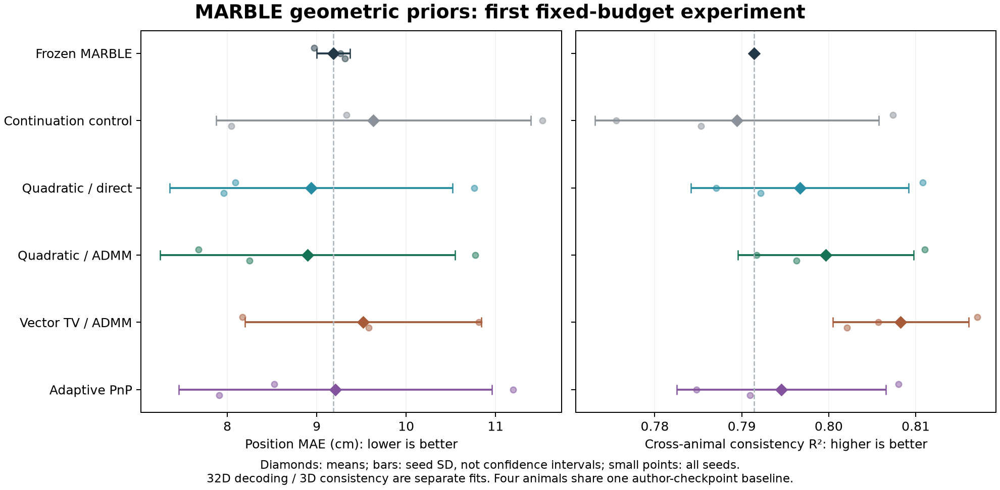

# MARBLE 几何先验、ADMM 与 PnP：首轮实验

二次图先验值得继续验证。本轮二次先验 + ADMM 的位置误差均值从
**9.184 cm 降至 8.899 cm（约 3.1%）**，四鼠一致性从 **0.7914 升至 0.7997**。
但种子间波动明显，不能据此断言稳定优于原模型，也不能断言 ADMM 优于直接优化。
直接优化同一先验得到 **8.938 cm / 0.7967**；相对匹配的继续训练对照，
它在三个种子上均同时改善两项指标，这是本轮支持先验作用的主要证据。

本实验是已有检查点上的探索性继续训练，尚不是从头训练、完整论文复现或新模型优越性证明。
实验固定于 2026-09-28，基于 KAIR `04ed0e1`，分支为
`codex/marble-geometry-admm`，依赖四鼠一致性实现。

## 数学假设与实际实现

[MARBLE 原文](https://www.nature.com/articles/s41592-024-02582-2) 的式 12
通过邻域正样本与随机负样本学习局部流场的表征。这里保留其 logistic 对比损失形式，
将正负样本分类看作辅助 Bernoulli 似然。这个 MAP 解释针对辅助分类模型，
不是神经活动的完整生成模型。

令训练特征为 H，编码器输出为 Z = Φθ(H)。仅用训练神经活动的 PCA 坐标和速度，
分别中心化并除以 RMS，建立固定的 15 近邻相空间图。令 L 为按最大加权度数缩放的
组合拉普拉斯，B 为满足 BᵀB = L 的加权关联矩阵。实验尝试两个明确的先验能量：

- 二次平滑：R₂(Z) = tr(ZᵀLZ)/(2n)，抑制图上相邻局部状态的表征差异。
- 向量总变差：Rtv(Z) = Σe ‖(BZ)e‖₂/n，允许少数边保留较大的表征跳变。

各组另有相同的弱高斯参数先验 R₀(θ) = 10⁻⁴‖θ‖²/(2P)，用于使条件先验适定。
明确先验的组优化 f(θ) + λR(Φθ(H))，其中 f 为对比损失加 R₀。
先验以观测图为条件，具体 MAP 缩放和条件独立假设见
[预先固定的实验协议](MARBLE_PRIOR_PROTOCOL.md)。图平滑与对比邻域假设存在重叠，
不是独立的生物学证据，也没有宣称理论创新。

ADMM 形式引入 V = Φθ(H)，将编码器拟合与先验处理分开：

1. 编码器步：近似最小化 f(θ) + ρ‖Φθ(H) − V + U‖²/(2n)。
2. 先验步：二次先验解 (ρI + λL)V = ρ(Z + U)；TV 使用投影对偶梯度求近端。
3. 对偶步：U ← U + Z − V。

实际输出始终来自更新后的编码器，不用辅助变量 V 代替训练集表征。
编码器约束非线性，编码器步仅做有限次 Adam 更新，所以这是非凸、非精确的
ADMM 风格算法，不能套用一般凸 ADMM 的收敛保证。
算法背景见 [Boyd 等](https://web.stanford.edu/~boyd/papers/admm_distr_stats.html)
和 [Parikh 与 Boyd](https://web.stanford.edu/~boyd/papers/pdf/prox_algs.pdf)。

PnP 组将近端换成一次自适应图扩散，边权根据当前表征差异衰减。
我们没有证明这个非线性去噪器对应某个先验的近端，也没有将它称为 MAP 求解器。
这种区别与 [PnP 原始工作](https://brendt.wohlberg.net/publications/venkatakrishnan-2013-plugandplay.html)
及 [consensus equilibrium](https://arxiv.org/abs/1705.08983) 的表述相符。

## 对照与数据隔离

五组为：无几何先验继续训练、二次先验直接优化、二次先验 ADMM、TV ADMM、PnP。
每组都从同一对应检查点出发，使用相同的固定正负样本、学习率和 300 次编码器更新。
BN 运行统计冻结，dropout 关闭；这是更新次数匹配，不是耗时或 FLOPs 匹配。
无几何先验的 control 也有共同的 R₀。

当前正样本来自新建的相空间图，区别于原 MARBLE 的 CkNN 随机游走采样。
因此与冻结原模型的差异包含继续训练及采样变化；**先验效应应优先看与 control 的配对差异**。
二次先验的直接优化与 ADMM 使用同一目标，用于区分先验与求解方式的作用。

三种子 × 五组 ×（一个解码任务 + 四只动物）共 **75 次 GPU 拟合**。
32 维解码与 3 维一致性分别拟合，表中的两项指标不来自同一套权重。

- 解码复用 Achilles 的 7,999 个训练锚点和 1,999 个测试锚点，以及三个已有检查点。
  测试集不参与先验图、梯度更新、BN 统计或模型选择；原有图特征预处理保持不变。
  最终仍用 cosine kNN，k = 36。
- 一致性使用四鼠各 9,999 个神经样本，分别从作者检查点继续训练。
  三次重复改变正负样本采样种子，不是三批独立动物或三组独立作者训练检查点。
  指标是按位置分箱、归一化后 12 个有向配对的样本内 OLS R²，不能解释成留出跨动物迁移。
- 拟合不读取行为标签；完成全部拟合后封存嵌入与源文件哈希，再执行行为评估。
  本轮固定最终迭代，不按分数筛选种子、调整超参数或选择检查点。
- 当前留出集已在此前研究中观察过，因此本轮结果仍是探索性的。

## 全部结果

± 为三个种子的样本标准差，不是置信区间。原模型一致性只计算一次，重复列入基线比较；
其标准差为零不表示估计没有不确定性。

| 方法 | 位置 MAE，cm ↓ | 四鼠一致性 R² ↑ |
| --- | ---: | ---: |
| 冻结 MARBLE | 9.184 ± 0.187 | 0.7914（单一检查点基准） |
| 匹配继续训练 control | 9.634 ± 1.758 | 0.7894 ± 0.0163 |
| 二次先验，直接优化 | 8.938 ± 1.579 | 0.7967 ± 0.0125 |
| 二次先验，ADMM | **8.899 ± 1.650** | 0.7997 ± 0.0101 |
| 向量 TV，ADMM | 9.520 ± 1.322 | **0.8083 ± 0.0078** |
| 自适应图 PnP | 9.209 ± 1.749 | 0.7946 ± 0.0120 |

逐种子结果，单元格为 MAE cm / R²：

| 方法 | seed 0 | seed 1 | seed 2 |
| --- | ---: | ---: | ---: |
| 冻结 MARBLE | 8.970 / 0.7914 | 9.264 / 0.7914 | 9.317 / 0.7914 |
| control | 9.332 / 0.8074 | 11.524 / 0.7756 | 8.046 / 0.7853 |
| 二次先验，直接优化 | 8.091 / 0.8108 | 10.760 / 0.7871 | 7.962 / 0.7922 |
| 二次先验，ADMM | 7.676 / 0.8110 | 10.776 / 0.7917 | 8.247 / 0.7963 |
| TV，ADMM | 8.170 / 0.8171 | 10.811 / 0.8057 | 9.580 / 0.8021 |
| PnP | 8.523 / 0.8080 | 11.196 / 0.7848 | 7.906 / 0.7909 |

可以支持的判断：

1. 二次先验直接优化相对 control 在三个种子上都同时改善两项指标。
   ADMM 二次先验相对 control 的一致性全部改善，但 seed 2 的 MAE 增加约 0.201 cm。
2. ADMM 二次先验相对冻结基线两项均值改善，但 seed 1 的 MAE 退步。
   它比直接优化只低约 **0.038 cm**、一致性高约 **0.0030**，不能支持确定的求解器优越性。
3. TV 三个种子的一致性都高于冻结基线，但平均解码误差更大。
   这符合可能存在平滑与保留局部区分度之间的取舍，尚未验证具体机制。
4. 本轮 PnP 平均 MAE 略差于冻结基线，一致性略好，没有获得整体优势。

## 数值检查与边界

所有 75 次拟合开始前都验证了原检查点的嵌入对齐，rtol = 2e-4、atol = 2e-5。
最终表征数值秩仍为 32 或 3，中心化 RMS 相对初始的比例约为 0.99997–1.00014。
未发现整体秩塌缩；这些量不能证明语义信息全部保留。

| 求解组 | 最终相对原始残差范围 | 最终相对对偶残差范围 | 近端子问题检查 |
| --- | ---: | ---: | --- |
| 二次 ADMM | 0.000550–0.001908 | 0.004229–0.017329 | 全部迭代的最大线性相对残差 1.36e-6，低于 2e-6 容差 |
| TV ADMM | 0.001601–0.004380 | 0.004294–0.013343 | 全部迭代的最大逐节点原始—对偶间隙 6.04e-5 |
| PnP | 0.000046–0.000329 | 0.004489–0.020671 | 仅报告迭代残差，没有近端或 MAP 证明 |

所有组都达到预设的 30 次外层迭代上限。小原始残差不等于整体收敛，更不等于全局最优。
总拟合阶段耗时约 142.3 秒，峰值 GPU allocated memory 约 1,000.7 MiB；
未包含原检查点训练、数据导出与最终评估，不能作为端到端速度结论。
环境为 uv 管理的官方 PyTorch 2.14.0+cu130、CUDA 13.0、Python 3.12.10，
GPU 为 RTX 5070 Ti Laptop。

本地完整测试 **325 passed**。新增 18 个用例覆盖独立稠密解对齐、TV 两节点解析解、
凸参考问题的 ADMM 解、图算子关系、CPU/CUDA 近端一致性、原对比损失对齐、
BN 冻结及查询批次独立性。凸参考问题的测试不证明神经网络优化收敛。
五个新增 Python 文件通过 Ruff E/F/I 与格式检查。

## 复查与下一步

运行命令及全部固定参数见 [实验协议](MARBLE_PRIOR_PROTOCOL.md)。实现入口为
[main_explore_marble_priors.py](../main_explore_marble_priors.py)，报告生成脚本为
[report_priors.py](../scripts/marble/report_priors.py)。大检查点及嵌入留在忽略的
`results/priors-20260928/`，小型公开记录位于
[reports/marble-priors-20260928](reports/marble-priors-20260928/)：

- `summary.json`：全部种子及 12 个有向配对的评估结果。
- `paired_changes.json`：相对匹配 control 与冻结基线的配对变化。
- `protocol.json`、`fit_complete.json`：源文件、输入、基线与输出嵌入哈希。
- `fit_diagnostics.json`、`iteration_history.csv`：75 次拟合的诊断及全部 2,250 条迭代记录。
- `comparison.png`、`comparison.pdf`：全部种子可视化。

后续最有价值的验证是预先固定新的时间切分或动物，继续配对比较 control、直接二次先验
与 ADMM 二次先验，检查均值改善是否跨数据保持。求解器研究则应单独比较目标值、
驻点诊断与计算预算，避免将先验收益归因于 ADMM。TV 可作为两项指标取舍的研究方向。
当前证据不足以将任一组宣布为稳定优于原 MARBLE 的替代方案。
