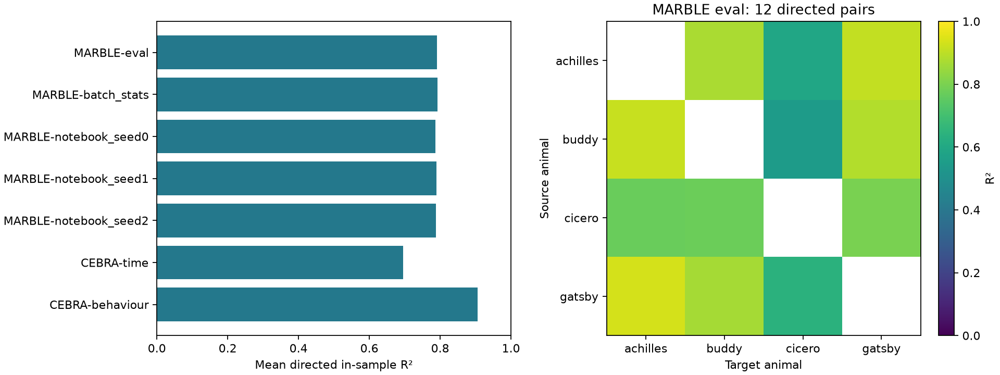
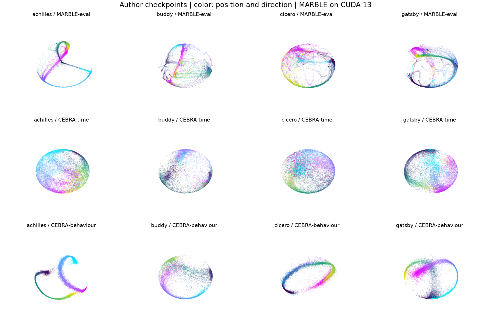

# 四只大鼠的 MARBLE 3D 作者模型核验

2026-09-30 后续：已完成精确 PCA 与固定 α=0.1 联合投影条件下的四动物
三种子从头训练，见 [扩展实验报告](MARBLE_MULTIRAT_RESULTS.md)。
下文仍是此前作者权重的核验，二者的模型与成绩不混合。

2026-09-28，分支 `codex/marble-rat-consistency`。
本轮完成 Achilles、Buddy、Cicero、Gatsby 的作者检查点在 KAIR CUDA 13 上的
特征、梯度、连续三步 SGD、表征及 12 个有向动物对的一致性核验。
这是作者模型重评估和实现验证，尚未完成四动物的 100 轮从头训练。

## 结论更正

此前计划把“MARBLE 一致性低于 CEBRA-behaviour”标记为复现失败，是对论文的误读。
论文 Results 的 “Consistent latent neural representations across animals” 最后一段
明确描述了 MARBLE 高于 CEBRA-time、低于 CEBRA-behavior 的关系。
本轮重评估符合这一排序。[论文 Fig. 5e 及对应正文](https://www.nature.com/articles/s41592-024-02582-2)。

这确认了作者检查点的比较方向和发布 notebook 的计算流程；
不能据此声称图中每个数字、全部训练重复或整篇论文都已复现。

## 结果与模式诊断

| 模型或推理模式 | 12 个有向对的平均 R² |
| --- | ---: |
| MARBLE，冻结 BN 与 dropout（eval） | 0.791400 |
| MARBLE，批次 BN、关闭 dropout（诊断） | 0.791814 |
| MARBLE，notebook 模式，dropout 掩码种子 0 | 0.787137 |
| MARBLE，notebook 模式，dropout 掩码种子 1 | 0.789369 |
| MARBLE，notebook 模式，dropout 掩码种子 2 | 0.788329 |
| CEBRA-time，作者权重 | 0.694798 |
| CEBRA-behaviour，作者权重 | 0.905799 |

三种 notebook 种子只改变推理时的 dropout 掩码，不是三个独立训练模型。
BN/dropout 影响约千分之几的平均分数，但不改变三个方法的排序。
`batch_stats` 是定位差异的诊断设置，未当作论文主结果。





图中 MARBLE 来自 KAIR CUDA；CEBRA 使用固定 CPU 包重算的作者表征。
两种颜色分别对应运动方向，明暗随位置变化；MARBLE 图采用 eval 模式。

## 对齐证据

在修改前，3D 配置的回归测试因 `dropout=0.5` 被拒绝而失败。
支持代码保持原版顺序：Linear → BatchNorm → ReLU → Dropout → Linear → 单位归一化，
输出线性层后不额外添加 dropout，权重键保持兼容。

- 四动物真实图上的特征、损失、全部有梯度参数、连续三步 SGD 后状态均通过原版对照。
- 全记录表征最大绝对差小于 `1.6e-6`；对齐后 R² 最大差小于 `1.5e-7`。
- 使用原接入的 `rtol=2e-4, atol=2e-5`，没有因本轮结果更改容差。
- 每种模式从相同作者状态开始，结束后恢复权重和 BN 缓冲，防止评估改变检查点。
- 同时重验旧 Achilles 32D 的真实图三步 SGD，原有协议仍通过。

小型测试样例由固定 CPU PyG 2.1 和原版 MARBLE 损失生成，不调用 KAIR 网络或损失。
它保存掩码、输出、损失、梯度和参数更新，并核实受控掩码等价于同一 CPU 种子的原生 dropout。
同一套样例在 CPU 与 CUDA 上执行；CUDA 测试在本机必须通过，CI 的无 GPU 作业明确排除。
另有 CEBRA 0.4.0 独立产生的分箱/一致性样例，覆盖全部有向对。

本机完整测试 **307 passed**（较前一分支增加 13 项），相关代码 Ruff 检查和格式检查通过。
四动物 GPU 核验及指标计算约 2.35 秒，峰值分配约 451 MiB；
该时间不含原版 CPU 准备和绘图，不能当作从头训练耗时。

可追溯产物：
[指标与运行环境](reports/marble-rat-consistency-20260928/summary.json)、
[逐动物数值核验](reports/marble-rat-consistency-20260928/reference_validation.json)、
[原版输入与来源](reports/marble-rat-consistency-20260928/input_receipt.json)、
[Achilles 回归核验](reports/marble-rat-consistency-20260928/achilles_regression.json)。

## 实际计算协议与边界

- 每只动物使用整段记录，PCA=10、out=3、hidden=64、dropout=0.5，一阶无扩散。
  位置与方向不进入 MARBLE 编码器，图坐标是神经活动的 PCA 坐标。
- 保留发布代码的时间单位和非零计数处理；固定 scikit-learn 1.3.2，保存 PCA 状态。
  原版近邻图、核和参考采样在 CPU 生成，KAIR 的图特征、网络、梯度与优化对照在 GPU 执行。
- 一致性评估使用**位置标签**对齐：共同位置范围生成 100 条边界，计算 99 个箱的表征均值并
  单位归一化。空箱最多向两侧扩展两个箱，仍无样本则报错；最高边界处理按 CEBRA 保留。
- 每个有向动物对拟合带截距的线性回归，并在这些分箱点上算 R²，属于拟合内指标。
  12 个有向对共享四只动物，不是 12 个独立实验样本；没有附加独立样本显著性推断。
- Methods 提及 Procrustes；发布 notebook 实际调用 CEBRA 的位置分箱与 OLS。
  本轮忠实实现后者，没有另加一次 Procrustes，也不把二者默认为同一个流程。
- notebook 没有调用 `eval()`。CPU/CUDA 核验共享原版 CPU 生成的 Bernoulli 掩码，
  避免把两个设备的随机数实现差异混为数值误差。实际训练仍调用 PyTorch 原生 dropout。
- 这里只核验一套公开作者权重。notebook 文案提到多次运行，不代表目前文件提供了全部训练重复。
  CEBRA 没有重新训练，也未将其网络移植到 KAIR CUDA。

## 重跑

先按 [环境与旧协议说明](README_MARBLE.md)准备 KAIR 的 uv CUDA 环境及固定 MARBLE CPU 环境。
需要 13 个作者文件：四动物记录、四个 MARBLE 3D 权重、八个 CEBRA 3D 权重。
来源与 SHA-256 固定在 [数据清单](reports/marble-20260928/full_reproduction_inventory.json)，
导出器在反序列化前检查大小与哈希。以下路径对应当前工作区布局，可通过 `--data` 指定其他目录。

```powershell
uv run --locked python scripts/marble/prepare.py `
  --marble-repo ../MARBLE `
  --python ../MARBLE/reproduction/.venv/Scripts/python.exe `
  --protocol rat-consistency `
  --data ../MARBLE-reproduction/paper/data/rat `
  --output results/rat-consistency-input

uv run --locked python main_test_marble_consistency.py `
  --input results/rat-consistency-input `
  --output results/rat-consistency-cuda `
  --device cuda:0

$env:MPLBACKEND = "Agg"
$env:MPLCONFIGDIR = "$PWD/results/.matplotlib"
uv run --locked python -m pytest tests -q
```

选择新输出目录以保留原始实验；核验失败时在首次不一致处停止。
在输出目录中保存完整表征与标签、图、检查点状态、每层参考值和来源哈希。
这些大文件不入库，仅提交小型报告与测试样例。

下一步：在同一协议下导出四动物的新初始化与采样计划，再从头训练并单列训练重复结果。
