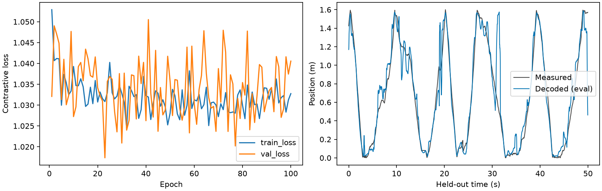

# MARBLE 接入 KAIR：首轮复现报告

2026-09-28，已在 KAIR 内完成 Achilles 单动物的三个种子从头训练，每个种子
100 轮。最终代码的主评估位置 MAE 为 **9.1837 ± 0.1867 cm**，其中 ± 表示
三个种子间的样本标准差。测试窗口共 1,999 个时间点。

这完成了 MARBLE 固定一阶、无扩散协议在 KAIR 的接入与运行，不是全论文
复现，也不承诺每次训练逐位一致。原始构图与采样仍使用独立的原版 CPU 环境。
完整准备、训练、核验命令见 [运行说明](README_MARBLE.md)。

## 结果

| Seed | 最佳轮次（从 1 开始） | 主评估 MAE / cm | 位置 R² | notebook 模式 MAE / cm |
| --- | ---: | ---: | ---: | ---: |
| 0 | 23 | 8.9702 | 0.908929 | 9.0300 |
| 1 | 59 | 9.2641 | 0.895503 | 8.7452 |
| 2 | 74 | 9.3167 | 0.903487 | 8.6103 |
| 均值 ± 种子间样本标准差 | — | **9.1837 ± 0.1867** | — | **8.7952 ± 0.2143** |

最终完整运行是 `results/marble-kair-20260928-final/`，输入重新从公开原始数据
生成于 `results/marble-input-20260928/`。GPU 训练、核验及解码共约 189.45 s，
PyTorch 峰值已分配显存约 936.59 MiB。运行期间也执行了测试，耗时不是独占
设备的性能基准。

## 与此前独立仓库复现的比较

| Seed | 2026-09-22 MARBLE 仓库 MAE / cm | KAIR 首次运行 / cm | KAIR 最终代码运行 / cm |
| --- | ---: | ---: | ---: |
| 0 | 9.7165 | 9.3259 | 8.9702 |
| 1 | 9.4825 | 9.4544 | 9.2641 |
| 2 | 8.7696 | 8.8592 | 9.3167 |
| 均值 | 9.3229 | 9.2131 | 9.1837 |

三组运行的输入图、初始权重和逐批采样序列相同，已通过哈希核对。最终运行与
9 月 22 日记录的学习率序列逐值相同，最佳轮次也相同；训练损失的最大绝对
差小于 0.00057，验证损失的最大绝对差小于 0.00109。

它们并非数值完全相同的训练。原生 CUDA 稀疏累加不保证逐位确定性，长程训练
及离散的近邻选择会产生结果差异。本报告保留两次 KAIR 运行，最终版本重跑是
为了验证新增的邻居编号记录和核验流程，未按测试误差挑选运行结果。
不能由上述均值的小差异推断 KAIR 实现优于原版。

## 原版数值核验

1. **训练前**：在真实 Achilles 图上，对照原版连续三次 SGD 的特征、表征、
   损失、权重和 BN 状态，组合容差 `rtol=2e-4, atol=2e-5`，全部通过。
   大幅值的 BN 方差按相对与绝对组合容差检查，不应将整体最大绝对差单独解释。
2. **训练后**：三个最佳检查点均重新加载进未修改的原版 MARBLE；测试表征的
   最大绝对误差分别为 **2.61e-7、2.98e-7、3.43e-7**。
3. **位置解码**：同一组表征交给旧环境中的 CEBRA KNNDecoder。
   主评估三个种子的最大预测差不超过 **5.97e-8 m**。
4. **并列邻居例外**：最终运行的 seed 2、notebook 模式在测试点索引 44
   （从 0 开始）相差约 **0.00690 m**。核验确认替换的邻居恰好与第 36 个
   邻居距离完全相同，属于并列选择，不放宽整体预测容差。首次运行的同类差异
   出现在 seed 1、notebook 模式索引 1545，约 0.00564 m。主评估未出现该例外。
5. **检查点与来源**：三个初始化哈希各不相同，均不同于作者权重；训练后权重
   已变化。最佳模型对应验证损失的最小值；记录中的运行源码和锁文件哈希已
   与本地实际文件核对一致。

原始核验数据见 [训练前对照](reports/marble-20260928/reference_validation.json)、
[原版回读与解码对照](reports/marble-20260928/original_code_audit.json)、
[旧运行比较](reports/marble-20260928/previous_run_comparison.json)。

## 测试和环境

- KAIR 全套 pytest：**294 passed**，包含 14 项新增 MARBLE 回归测试，以及
  CUDA 张量、DnCNN 训练和 TorchVision CUDA 算子测试。原有代码/依赖仍有
  弃用提醒；测试的小图稀疏 oracle 另有不影响结果的 PyTorch 提醒。
- 新增模块及修改的 Python 文件通过 Ruff lint；新增模块和修改的测试文件
  通过 Ruff format 检查，两个既有工厂文件保留原排版。
- `uv pip check`、离线 `uv lock --check`、`git diff --check` 通过。
- Windows、Python 3.12.10、RTX 5070 Ti Laptop GPU；训练用
  PyTorch 2.14.0+cu130 / CUDA 13.0、NumPy 2.5.1、scikit-learn 1.9.1。
  原版构图和回读使用固定的 PyTorch 2.5.1 CPU / PyG 2.1 环境。

详细环境及代码哈希：[训练记录](reports/marble-20260928/provenance.json)、
[原始导出来源](reports/marble-20260928/input_export_provenance.json)。

## 已保存的产物与限制

小型可提交快照位于 [reports/marble-20260928](reports/marble-20260928/summary.json)，
包含完整协议、逐种子指标、损失历史、核验记录、来源信息和曲线。
首次运行的 [summary](reports/marble-20260928/initial_run_summary.json) 与
[源码哈希](reports/marble-20260928/initial_run_provenance.json) 也保留。
大文件留在本地 `results/`：原始图、采样序列、随机初始状态、最佳/最后检查点、
表征、预测和实际邻居编号；重新运行可生成，未纳入 Git。

目前仅覆盖 Achilles 和固定时间划分，不是跨动物或所有实验的复现。保留了
原作者预处理的时间单位及计数处理，也保留 PCA=20、lr=1 等本次协议选择。
整段测试窗口用于构建测试图，属于离线解码。CEBRA 未从头训练，扩散、可训练
内积特征以及其他动物尚未接入。进一步验证需要单独扩展实验范围。
