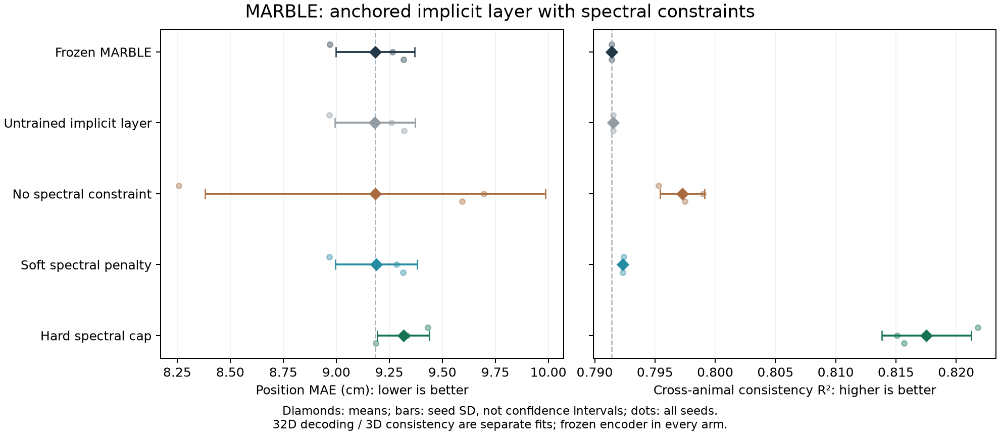

# MARBLE 谱约束与伪压缩网络实验

硬谱约束成功建立了固定点推理的结构保证，四鼠一致性均值从 **0.7914 提升到 0.8175**，
但位置 MAE 从 **9.184 cm 变为 9.317 cm**。本轮是指标取舍，不能称为全面优于原模型。
软谱正则只把谱界压到接近 1，仍未获得需要的伪压缩证书。

## 网络改造

本轮在冻结的 MARBLE 编码器后接入一个可训练的隐式表征层。它是部署网络的一部分，
新样本通过同一套权重求解，不需要重新拟合。训练目标使用神经活动构建的几何图，
不使用位置或动物对齐标签。对比三组：无谱约束、软谱正则、硬谱约束；
另外记录原 MARBLE 和未训练隐式层，区分结构改变与学习的影响。

修改的是表征网络。原编码器、BN 统计和已有权重保持冻结，以隔离新模块的作用。
与上一轮更新原编码器的二次先验/ADMM 实验不是纯求解器比较。
本次学习的表征不再单位归一化，故对比损失虽然保留 logistic 形式，
也包含表征尺度的变化；三个学习组共享这个选择。

## 可证明的性质

令原编码器输出为 q，新网络定义为：

```text
N(z) = W2 [2 tanh((W1 z + b1)/2)] + b2
D(z) = 2N(z) - z
Gq(z) = ||z-q||²
Tq(z) = D(z) - grad Gq(z)
z_next = (3/4)z + (1/4)Tq(z) = (N(z)+q)/2
```

激活的 Lipschitz 常数不超过 1。硬约束在每次 Adam 更新后，用双精度小矩阵 SVD
将每层最大奇异值限制到 0.999，故 N 的全局 Lipschitz 上界为
L ≤ 0.999² = 0.998001。没有使用幂迭代的近似最大奇异值作为严格上界。
软正则只惩罚 `max(sigma_max(W)-1, 0)²`，不能自动给出同样保证。

在精确算术下，固定权重满足 L ≤ 1 时：

1. D 是 1/2-严格伪压缩，因为 `(I+D)/2 = N` 非扩张。
2. 完整映射 Tq 是 2/3-严格伪压缩；其相应平均映射的 Lipschitz 上界是
   `(1+2L)/3 ≤ 1`。没有只证明去噪器 D 就跳到整体结论。
3. 实际推理映射 `(N(z)+q)/2` 的压缩因子不超过 L/2，因此在整个欧氏空间上
   有唯一固定点，从任意起点迭代都收敛。残差 r 给出后验误差界 `r/(1-L/2)`。
4. 收敛后的表征映射 F 满足
   `||q-p||/(2+L) ≤ ||F(q)-F(p)|| ≤ ||q-p||/(2-L)`。
   对硬约束组可简化为原距离的 1/3 到 1，排除了不同锚点合并为同一点。

最后一个结论来自 `q-p = 2(F(q)-F(p)) - (N(F(q))-N(F(p)))` 的三角不等式。
它约束欧氏距离，不保证 cosine 距离、行为语义、数值秩或跨动物一致性。
输出端没有再做单位归一化，否则该距离界不再直接成立。

这些结论针对冻结权重后的隐式推理。Adam 的训练过程仍然非凸，16 步展开的梯度
也不是精确隐式梯度；没有证明训练收敛或全局最优。一般神经算子未必对应某个标量能量，
因此本轮是平衡点网络，不把它称为 MAP 求解器。
SVD 结果是浮点数值核验，不是区间算术形式化认证。

对于无约束或软正则组，即使最终 L 大于 1，只要 L 小于 2，推理仍有压缩保证；
但此时不能从这个上界得到 D 的 1/2-严格伪压缩证书。
上界没通过不等于性质必然不成立，采样 Jacobian 通过也不等于全局性质成立。

理论背景来自 [Wei、Chen、Li，ICML 2024](https://proceedings.mlr.press/v235/wei24b.html)。
本实验使用的是上述带锚点构造，不是该论文图像任务的复现，也未声称理论创新。

## 固定实验设计

三组各运行三个种子，每个种子包含一个 32 维解码任务和四个独立的 3 维动物模型，
共 45 次 GPU 拟合；另有 15 组未训练结构对照。
各组使用相同初始化、训练样本对、300 次 Adam 更新与最终权重。
原检查点输出与缓存参考对齐；测试样本不参与几何图、梯度或权重选择。

所有拟合完成并封存后，统一使用原有的 cosine kNN k=36 解码和按位置分箱的四鼠
样本内 OLS 一致性。32 维与 3 维分别拟合，两项结果不来自同一套模型。
四鼠重复仅改变样本对种子，不是新增独立动物。
当前留出集已经在前轮观察过，结论属于探索性结果。

完整参数、理论适用条件、数据隔离和执行命令见
[固定协议](MARBLE_SPECTRAL_PROTOCOL.md)。

## 结果与诊断

± 为三个种子的样本标准差，不是置信区间。冻结基线的一致性使用同一组作者检查点，
并非三组独立重复；未训练结构对照的一致性也基本相同。

| 方法 | 位置 MAE，cm ↓ | 四鼠一致性 R² ↑ |
| --- | ---: | ---: |
| 冻结 MARBLE | 9.184 ± 0.187 | 0.7914（同一基准） |
| 未训练隐式层 | 9.183 ± 0.189 | 0.7915（同一结构初始化） |
| 无谱约束 | 9.183 ± 0.803 | 0.7973 ± 0.0018 |
| 软谱正则 | 9.189 ± 0.193 | 0.7923 ± 0.0001 |
| 硬谱约束 | 9.317 ± 0.123 | **0.8175 ± 0.0037** |



逐种子结果，单元格为 MAE cm / R²：

| 方法 | seed 0 | seed 1 | seed 2 |
| --- | ---: | ---: | ---: |
| 冻结 MARBLE | 8.970 / 0.7914 | 9.264 / 0.7914 | 9.317 / 0.7914 |
| 未训练隐式层 | 8.967 / 0.7915 | 9.261 / 0.7915 | 9.320 / 0.7915 |
| 无谱约束 | 8.258 / 0.7953 | 9.696 / 0.7990 | 9.594 / 0.7975 |
| 软谱正则 | 8.967 / 0.7924 | 9.284 / 0.7922 | 9.315 / 0.7923 |
| 硬谱约束 | 9.431 / 0.8218 | 9.333 / 0.8151 | 9.186 / 0.8157 |

硬谱约束相对冻结基线的一致性在三个种子上都改善，均值提高约 0.0261；
MAE 两个种子退步，一个改善，均值增加约 0.133 cm（1.45%）。
相对同结构无约束组，一致性三个种子均改善，MAE 仍有种子间取舍。
软谱正则的 MAE 接近基线，一致性只小幅变化，未取得整体领先。
不对三种子或依赖的动物配对作统计显著性声明。

| 诊断，15 个模型/组 | 无谱约束 | 软谱正则 | 硬谱约束 |
| --- | ---: | ---: | ---: |
| 最终 N 的层谱乘积上界 | 1.3715–1.6943 | 1.0328–1.0528 | 约 0.998001 |
| D 的 1/2-严格伪压缩证书 | 0/15 | 0/15 | **15/15** |
| 完整推理压缩证书 | 15/15 | 15/15 | 15/15 |
| 最大推理步数，训练样本 | 66 | 17 | 16 |
| 最大采样 D Jacobian 算子范数 | 2.3471 | 1.0901 | **1.0586** |
| 最大采样对称 Jacobian 特征值 | 2.3303 | 1.0901 | 0.9956 |
| 16 步展开与最终求解的最大表征差 | 0.02339 | 6.63e-7 | 8.28e-7 |

硬谱约束组出现算子范数大于 1 的采样点，因此该去噪器并非全局非扩张，
而其结构仍保证严格伪压缩。这正体现了允许的算子范围比非扩张更宽。
无约束和软正则组的部分采样点还出现对称 Jacobian 特征值大于 1，
提供违反普通伪压缩条件的局部数值证据；不是仅凭层谱上界超过 1 作否定判断。
但完整锚点迭代的 Lipschitz 上界 L/2 仍小于 1，故三组最终推理都有收敛保证。

所有训练及测试推理均达到预设的逐样本后验误差界 1e-6。
三组最终数值秩均完整，未发现整体秩塌缩；不据此宣称语义完全保留。
无约束组的有限展开误差明显较大，意味着比较也包含训练截断误差的影响，
不能把组间差异全部归因于谱约束的几何归纳偏置。

全部拟合阶段耗时约 232.8 秒，峰值 GPU allocated memory 约 1,000.8 MiB。
环境为官方 PyTorch 2.14.0+cu130、CUDA 13.0、Python 3.12.10，RTX 5070 Ti Laptop。
耗时不含原编码器训练、数据导出及最终评估，不作速度优越性结论。

完整审计记录位于 [reports/marble-spectral-20260928](reports/marble-spectral-20260928/)：
`summary.json` 保留所有种子和 12 个有向配对，`certificates.json` 汇总证书，
`fit_diagnostics.json` 保留全部 60 组诊断，`iteration_history.csv` 含 1,350 条训练记录，
`protocol.json` 与 `fit_complete.json` 保留源文件、输入、基线和输出嵌入哈希。
大模型及嵌入位于忽略的 `results/spectral-20260928/`。

后续应优先在新时间切分或动物上检查一致性增益与解码损失是否保持，
并在训练阶段控制展开误差后再比较谱处理。若将原编码器解冻联合训练，
固定权重后的隐式层证书仍可保留，但不能推广为整个输入到输出网络的全局谱界，
也不能推广为训练算法收敛证明。

## 使用与验证

新模型位于 [network_marble_spectral.py](../models/network_marble_spectral.py)，
实验入口为 [main_explore_marble_spectral.py](../main_explore_marble_spectral.py)。
`FrozenMARBLESpectral` 将原模型与新层组合；`forward` 返回训练用的有限展开，
部署及本轮评估使用 `solve` 返回的表征和残差证书。

```python
checkpoint = torch.load(model_path, weights_only=True)
base = MARBLEEncoder(checkpoint["params"])
base.load_state_dict(checkpoint["base_state"], strict=True)
latent = SpectralLatentLayer(checkpoint["channels"])
latent.load_state_dict(checkpoint["latent_state"], strict=True)
network = FrozenMARBLESpectral(base, latent).cuda().eval()
embedding, diagnostic = network.solve(features.cuda())
```

本地完整测试 337 passed，新增 12 个用例验证真实谱范数、软正则的梯度与局限、
可扩张但严格伪压缩的例子、解析 Jacobian、完整 Mann 更新、后验误差和距离界、
查询批次独立性、原编码器冻结、三种训练处理以及 CPU/CUDA 对齐。
不能用这些有限测试代替全局理论证明。
