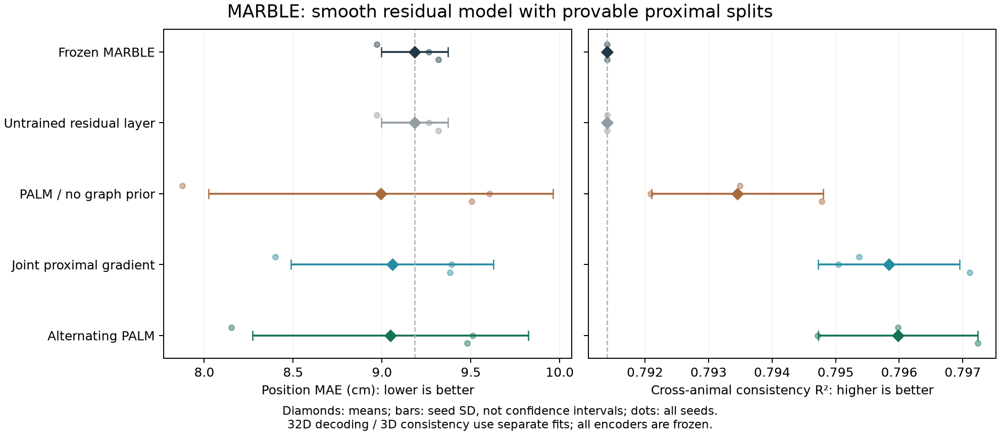
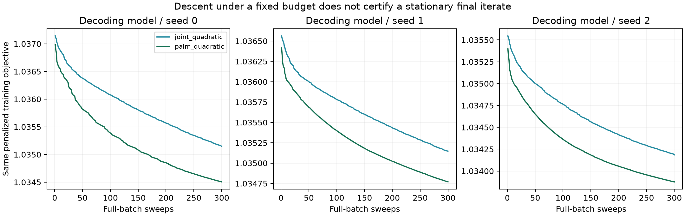

# MARBLE：先证明训练拆分，再评估结果

已找到能闭合训练收敛论证的 PALM / 同步近端梯度方案，并完成 45 次 CUDA 13 拟合。
PALM 的平均 MAE 从 9.184 降至 9.047 cm，一致性从 0.7914 升至 0.7960；
但 MAE 仅一个种子变好，另外两个变差，因此目前不能认定为稳定的性能提升。

## Material Passport

- Origin Skill: academic-research-suite / experiment-agent；run + validate。
- ID: MARBLE-PROVABLE-SPLITTING-20260928；Version: exp_result_v1。
- Origin Date: 2026-09-28；Verification Status: ANALYZED。
- 范围：可训练残差网络和辅助变量的训练迭代；原 MARBLE 编码器冻结。
- 理论先提交 `39a3cb1`，实现及固定协议再提交 `c810cb7`，随后才开始真实数据训练。
- 本轮未进行第二次完整重跑；单元测试和诊断不等同于独立复现实验。

## 数学筛选的结论

检查了 ADMM、非凸线性化 ADMM/ALM、Douglas–Rachford、Peaceman–Rachford、
HQS、PnP/伪压缩迭代和 PALM。非凸 ADMM 存在收敛理论，但不能把固定几步 Adam
当成已满足误差条件的子问题解；上一轮的固定权重推理证明也不能替代训练收敛证明。

本轮选择 **PALM 交替近端线性化**，并实现同目标的**同步近端梯度 PFB**作为对照。
新网络为光滑残差层，输出采用带 epsilon 的软归一化。每个矩阵限制在谱球中，
每个偏置限制在欧氏球中。优化目标明确为：

```text
F(theta,V) = pair_loss(Ztheta)
           + lambda tr(V^T L V)/(2n)
           + eta ||V-Ztheta||²/(2n)
           + beta ||theta||²/(2P) + indicator_C(theta).
```

两块变量分别为网络参数 theta 和辅助表征 V。谱球近端使用逐个奇异值截断，
是 Frobenius 最近点投影；统一缩放整张矩阵不能代替这个近端。
训练用固定样本对、全批梯度、精确分离近端与回溯，没有隐藏的 Adam/CG 内循环。

在明确的精确算术模型下，已补齐证明链：

1. 紧参数约束与正的耦合罚项保证迭代有界，光滑梯度在所需紧集上 Lipschitz。
2. 回溯有限终止，接受步长有统一正下界；目标满足充分下降不等式。
3. 近端最优性给出相对误差界，聚点满足包含谱球法锥的约束驻点条件。
4. 光滑解析目标与可定义约束满足 KL 性质，整个序列具有有限路径长度并收敛。

这是**参与优化的全部参数与 V 的训练收敛论证**，结论是约束临界点。
它不保证全局最优、唯一解、既定收敛速度、有限 300 步已经收敛或行为指标改善。
原编码器不参与训练，所以该结论不是原始 MARBLE 端到端训练的收敛定理。
这里也不声称整个残差网络具备上一轮隐式层的伪压缩性质。

理论依据：[PALM](https://bolte.perso.math.cnrs.fr/BST2013.pdf) 和
[充分下降—相对误差—KL 框架](https://bolte.perso.math.cnrs.fr/MPA.pdf)。
完整适用性审查与逐步推导见 [理论文档](MARBLE_SPLITTING_THEORY.md)。
这是既有收敛框架在当前明确模型上的应用，没有声称新定理或已通过同行评审。

## 目标与评价边界

有限 eta 的辅助变量罚项改变了图先验。精确消去 V 后得到
`K = eta lambda L (eta I + lambda L)^(-1)`，其谱响应为
`eta lambda mu / (eta + lambda mu)`，是二次图先验的平滑包络。
本轮两个 lambda=1 求解器优化相同目标，不能把它们与原硬等式 ADMM 称为等价。

固定 eta=1、lambda=1，另设 lambda=0 的 PALM 无图先验对照。三个学习组同初始化，
各训练 300 轮，选择最终权重，部署 Ztheta 而非 V。保留原 MARBLE 和未训练结构对照。
拟合三个种子，每个种子含一个 32 维解码模型、四个独立 3 维动物模型，共 45 次。
训练不读取行为标签；全部输出封存后，统一计算 k=36 cosine kNN 解码与四鼠 OLS 一致性。

一致性是按行为位置分箱、样本内拟合的 12 个有向动物对得分，不是留出动物泛化。
两项指标来自不同维度的独立模型；四鼠的三个种子只改变样本对，并非增加独立动物。
完整配置和执行命令见 [固定协议](MARBLE_SPLITTING_PROTOCOL.md)。

## 结果

± 表示三个种子的样本标准差，不是置信区间。基线一致性重复使用同一组作者权重，
所以不把其 SD=0 当作独立实验的稳定性证据。

| 模型 / 求解器 | 位置 MAE，cm ↓ | 四鼠一致性 R² ↑ |
| --- | ---: | ---: |
| 冻结 MARBLE | 9.1837 ± 0.1867 | 0.791400 |
| 未训练残差层 | 9.1837 ± 0.1867 | 0.791400 |
| PALM，无图先验 | 8.9945 ± 0.9690 | 0.793453 ± 0.001349 |
| 同步近端梯度，平滑图先验 | 9.0574 ± 0.5703 | 0.795838 ± 0.001111 |
| PALM，平滑图先验 | 9.0473 ± 0.7755 | 0.795978 ± 0.001256 |



PALM 相对冻结基线的配对差值（MAE 负值较好，R² 正值较好）：

| 种子 | MAE 变化，cm | 一致性 R² 变化 |
| --- | ---: | ---: |
| 0 | -0.818206 | +0.004582 |
| 1 | +0.247560 | +0.003321 |
| 2 | +0.161597 | +0.005833 |

一致性在三个种子上均高于冻结基线；平均 MAE 的降低由种子 0 驱动。
与无图先验的同结构 PALM 相比，图先验让平均 MAE 变差 0.0528 cm，
一致性增加 0.002525。因此不能把全部学习收益归因于图先验。
PALM 相对同步更新仅有 0.0101 cm 的平均 MAE 优势和 0.000140 的一致性差异；
种子间方向不一致，没有足够证据声称 PALM 在行为指标上稳定优胜。

前轮硬谱隐式层的一致性更高（0.8175），但 MAE 为 9.3166 cm；前轮二次 ADMM
的 MAE 均值为 8.8995 cm。它们的目标、网络和训练范围不同，不能作为纯求解器排名。
本轮主要推进的是训练理论与实现的对应关系，尚未获得全面占优的实验模型。

## 数值检查与求解进度

45 次拟合共 13,500 轮更新全部完成；没有崩溃、重跑、丢弃种子或失败回溯。
每次接受的更新都满足数值上界及充分下降检查，目标上升次数为 0。
最小充分下降余量为 4.51e-7；最小上界接受余量为 8.27e-11，均为正。
谱/偏置约束最大浮点超出量为 2.44e-15；该结果是数值核验，不是形式化误差认证。
参数步长在 0.5 到 16 之间，每轮最多减半 5 次。

| 求解器 | 15 次拟合时间，秒 | 最终参数近端梯度映射范数范围 | 最大辅助驻点力 RMS |
| --- | ---: | ---: | ---: |
| PALM，无图先验 | 152.4 | 5.75e-4 ～ 1.74e-3 | 7.42e-4 |
| 同步近端梯度 | 149.6 | 7.06e-4 ～ 1.48e-3 | 7.14e-3 |
| PALM，平滑图先验 | 156.4 | 6.03e-4 ～ 1.69e-3 | 1.19e-3 |

同目标的 15 个配对任务中，PALM 有 12 个最终目标低于同步更新，其中三个解码任务
全部更低。PALM 的辅助变量驻点残差有 14/15 更低，但参数驻点残差并非一致更低。
同步回溯同时缩小 V 步长，PALM 保留其独立的合法步长，这解释了 V 块进展的差异。
PALM 时间略长，不能只按轮数宣称计算更快。



残差尚未接近零，曲线仍在下降；**不能把 300 轮当成实际到达驻点**。
所有最终表征保持预期数值秩（32 或 3），但数值满秩不证明行为信息被完整保留。
总拟合阶段 461.5 秒，峰值分配显存 1000.8 MiB，使用 RTX 5070 Ti Laptop、
官方 PyTorch 2.14.0+cu130。基础编码器/建图为 float32，新增训练为 float64。
拟合与评价退出码均为 0；评价前验证了源代码、协议、输入、基线和 60 份输出的哈希。

## 统计解释审查

11/11 项已检查：聚合与分组方向不一致已通过逐种子表揭示；分箱一致性不推断
单神经元机制；四鼠和已有检查点的选择限制外推；行为条件化不作因果解释；
基准率不适用于此连续回归评价；不只挑选极端种子；所有拟合均保留；
多轮探索和反复观察留出集存在选择风险；本轮协议在训练前固定但不是预注册；
相关一致性不证明生物因果机制；不推断反向或正向生物因果关系。
没有报告 p 值、显著性、置信区间或将依赖的 12 个动物对当独立样本。

## 交付与验证

- [完整指标与全部动物对](reports/marble-splitting-20260928/summary.json)
- [逐拟合数值检查](reports/marble-splitting-20260928/numerical_checks.json)
- [全部迭代记录](reports/marble-splitting-20260928/iteration_history.csv)
- [配对差值](reports/marble-splitting-20260928/paired_changes.json)
- 模型、辅助变量、样本对和表征保存在本地 `results/splitting-20260928`。
- 全套 pytest：350 passed；新增 13 项数学/CPU/CUDA 检查。
- 新增 Python 文件通过 Ruff E/F/I 与格式检查；两张图已渲染并目视检查。

继续推进时应先区分两个问题：能否通过固定驻点残差准则达到更充分的优化，
以及该先验是否对未使用的留出数据有稳定价值。当前结果不能用来替代这两个验证。
