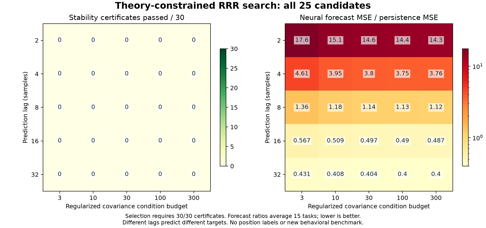

# 理论约束超参搜索：25 组均未获得稳定性证书

## Material Passport

- 2026-09-28；承接 [数学推导](MARBLE_MATH_FOUNDATIONS.md)和
  [首次条件审计](MARBLE_THEORY_AUDIT.md)。
- 搜索前固定 [候选、数据划分、筛选和选择规则](MARBLE_SEARCH_PROTOCOL.md)，
  执行时记录源码、数据及 uv 锁文件 SHA-256。
- 官方 PyTorch `2.14.0+cu130`、CUDA 13、RTX 5070 Ti Laptop；
  搜索实际使用 GPU，耗时 417.55 秒，不含先前的数据前处理。
- 结果：**0/25 组可选，`selected = null`，没有进行新的行为 MAE/R² 评估。**

## 搜索什么，为什么搜

搜索条件数预算 `{3,10,30,100,300}` 与预测间隔 `{2,4,8,16,32}` 的组合。
前者通过协方差极值特征值公式确定 ridge，控制求逆的数值条件；后者改变
动力学预测目标。两者都有明确含义，但理论没有保证它们会改善行为指标。

每组覆盖 3 个地标种子、Achilles rank 32 和四动物 rank 3，共 15 个任务。
每个任务在训练整体与两个时间半段之间检查
`2 * ||H_half - H_train||₂ < gap_r(H_train)`。全部 30 次比较通过，
该组才有资格按内部验证误差参与选择。没有搜索表征维数或 decoder。

## 全部结果

375 次候选任务评估产生 750 次谱稳定性比较，**通过数为 0/750**。
25 组的正则化协方差条件数均达到所设预算（浮点误差范围内），
说明控制求逆条件数本身不足以解决这批数据上的截断子空间问题。



| 汇总项 | 结果 |
| --- | ---: |
| 候选数 | 25 |
| 每组评估任务 / 稳定性比较 | 15 / 30 |
| 通过全部比较的候选 | 0 |
| 观察到的最低平均验证误差比 | 0.399605 |
| 对应设置，仅供诊断 | lag 32，条件数预算 300 |
| 该设置的证书通过数 | 0/30 |
| 入选设置 | 无 |

验证误差比是“未来核特征预测 MSE / 保持当前核特征不变的 MSE”，
对 15 个任务等权平均。比值低于 1 表示优于对应时滞的 persistence 基准，
**不是位置解码误差，也不是跨动物一致性改善**。不同 lag 预测不同目标；
这个归一化不保证不同预测间隔具有同等难度，不能据此宣称长 lag 普遍更好。

最低验证误差的设置也未通过理论条件，因而没有被选中。结果没有通过
放宽门槛、只报告部分动物或增加表示维数来转换成“成功”。

## 解释边界与后续依据

失败的是当前有限网格下、针对观察到的时间分段扰动的充分条件；它不证明
RRR 必然不稳定，也不排除网格外参数或其他理论证书。有限维 RRR 最优解
和已推导的条件性扰动界仍成立。三个种子不是三个独立动物样本，750 次
比较也不能当作独立统计重复。

字典只在前 60% 神经序列上拟合，内部验证前隔离 64 个样本；时滞对不跨
各自窗口边界。旧 PCA/平滑输入仍被复用，因此这是固定输入空间中的
子模块验证，不是从原始 spikes 开始完全隔离的端到端验证。
没有使用行为标签或 Achilles 外部测试图。lag 至少为 2 仅避免前向差分
直接揭示下一状态这一特定重叠，不足以保证严格因果性或时间独立性。

本轮没有依据继续扩大同一网格。下一步若采用软谱过滤，须先完成首次
审计中提出的稳定性与信息保留约束，并证明评估不会因高维拟合而虚高；
这只是后续研究条件，本轮未实现或评估该模型。

## PR 状态与核验

- [PR #3](https://github.com/LevelDownRefine/KAIR/pull/3)：扩散模型两项均退步，
  已关闭，分支与负结果保留。
- [PR #4](https://github.com/LevelDownRefine/KAIR/pull/4)：旧 VAMP 解码改善、
  一致性下降，保留草稿；本轮 RRR 搜索不替换它的历史分数。
- [PR #5](https://github.com/LevelDownRefine/KAIR/pull/5)：GW 平均一致性改善、
  解码下降，保留草稿。基础复现 PR #1/#2 继续保留。

全套测试按 GPU 使用需求分两次执行：非 CUDA 部分 **318 passed**，
CUDA 部分 **12 passed**，合计 **330 passed**。新增测试覆盖无候选可选、
验证最优但不合格的候选不能入选、确定性并列规则、时间边界，以及 CPU/GPU
上验证数据不能改变拟合 ridge 或训练稳定性证书。新增三个 Python 文件
通过 Ruff E/F/I 与格式检查。测试检查实现，不替代数学证明。

完整证据：[25 组表格](reports/marble-search-20260928/table.md)、
[全部逐任务结果](reports/marble-search-20260928/search.json)、
[环境与哈希](reports/marble-search-20260928/protocol.json)、
[PDF 图](reports/marble-search-20260928/search.pdf)。

重跑需保留固定输入及旧协议；输出目录必须不存在：

```powershell
../KAIR/.venv/Scripts/python.exe main_search_marble_theory.py --input ../KAIR/results/marble-input-20260928 --rat-input ../KAIR/results/rat-consistency-input-20260928-final --original-run results/math-20260928 --output results/theory-search-new
../KAIR/.venv/Scripts/python.exe scripts/marble/report_theory_search.py --input results/theory-search-new --output docs/reports/marble-search-new
../KAIR/.venv/Scripts/python.exe -m pytest tests -q -k 'not cuda' --disable-warnings
../KAIR/.venv/Scripts/python.exe -m pytest tests -q -k cuda --disable-warnings
```
