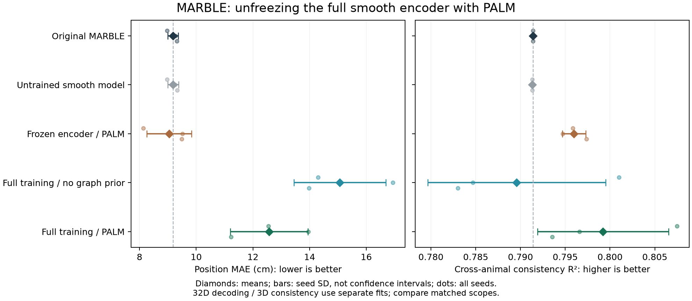
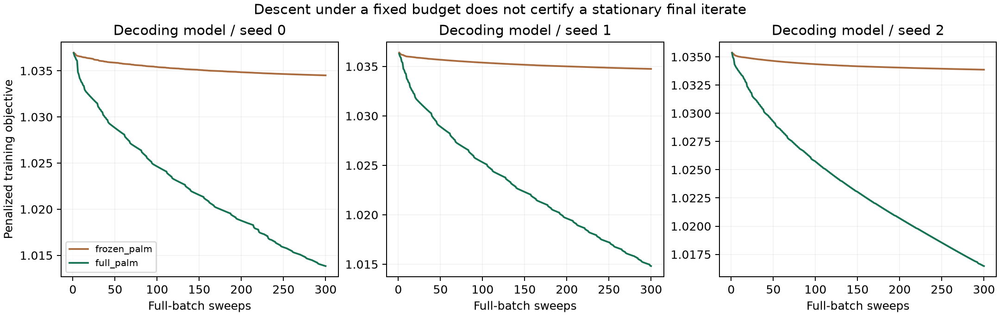

# MARBLE 全参数 PALM 实验

**不冻结可以建立同样的基本训练收敛论证，但本轮位置解码明显退化。**
全参数有先验组的 MAE 为 12.572 cm，匹配冻结组为 9.046 cm，三个种子均变差；
一致性均值由 0.7960 小幅升至 0.7992，只有两个种子优于冻结对照。

## Material Passport

- Origin Skill: academic-research-suite / experiment-agent；run + validate。
- ID: MARBLE-UNFROZEN-PALM-20260928；Version: exp_result_v1。
- Origin Date: 2026-09-28；Verification Status: ANALYZED。
- 用户问题：上一轮可证明的训练方案能否不冻结原编码器？
- 理论提交 `1583115` 先于实现及真实数据实验；实现与固定协议提交 `7e9f095`。
- 本轮为一次固定协议试验；进程中断后只补齐缺失拟合，没有独立第二次完整重跑。
- 数值检查不等于形式化验证，中断及一次不完整拟合的重启另行记录。

## 不冻结时，证明需要什么

冻结不是上一轮收敛论证的必要条件。将全部有效编码器权重 phi 与新增层 theta
合并为参数块 w=(phi,theta)，只要完整映射对 w 光滑，并约束所有优化参数，
就仍可使用相同的 PALM/KL 证明框架。

这要求明确修改原网络：把推理态 BatchNorm 精确吸收进首层仿射变换，随后让该
仿射变换的全部权重和偏置参与训练；用光滑正部替代 ReLU，采用带 epsilon 的
软归一化。移除随机 dropout 与 BN 移动状态。固定神经图特征和训练数据标准化
是输入预处理，不属于冻结网络权重，也不声称训练了图结构。

BN 折叠前后函数与输入梯度的对齐已单独测试；**平滑激活的替换会改变函数**。
因此新模型不是原训练态 BN/ReLU MARBLE 的逐操作等价复现。
原未启用的 diffusion_time 不影响输出，已从新模型中移除，避免把无效参数算作训练。

全部有效网络参数共有八个张量：原编码器两层的权重/偏置四个、新残差层四个。
编码器约束半径按初值固定为 `max(1,1.25*norm(initial))`，新增层半径为 1。
矩阵投影使用每个奇异值截断，向量投影到欧氏球；不只对新增层施加约束。

证明的条件链为：完整网络解析 → 参数紧约束和正耦合罚项保证迭代有界 →
回溯与精确分离近端给出充分下降 → 相对误差界与 KL 性质 →
**整个参数块和辅助变量的序列收敛到一个约束临界点**。
结论针对精确算术、固定数据/样本对/图与完整迭代序列，不保证全局最优、
固定 300 轮到达驻点或解码性能提升。

推导及边界见 [全参数理论](MARBLE_UNFROZEN_THEORY.md)。依据是
[PALM](https://bolte.perso.math.cnrs.fr/BST2013.pdf) 与
[充分下降—相对误差—KL 框架](https://bolte.perso.math.cnrs.fr/MPA.pdf)，不声称理论创新。

## 实验如何隔离解冻的影响

三组同网络、同初值、同数据和同样本对，各运行 300 轮 PALM：

| 组 | 编码器参数 | 图先验 |
| --- | --- | --- |
| frozen_palm | 冻结 | 有 |
| full_no_prior | 全部训练 | 无 |
| full_palm | 全部训练 | 有 |

新增层和辅助变量 V 在三组中均训练。另记录原 MARBLE 和未训练修改结构。
冻结和全参数有先验组的目标定义一致，冻结组是限制 phi=phi0 的子空间；高斯项
在两组使用相同的总参数数目 P，含固定编码器的常数项。上轮冻结数值仅作背景，
因为平滑结构和参数数目归一化已改变；判断解冻收益应使用本轮匹配的 frozen_palm。

固定 eta=1、lambda=1 或 0、beta=1e-4、平滑 delta=.05、归一化 epsilon=.1。
使用与上轮相同的显式 V 步和精确谱近端回溯，没有 Adam 或隐含的非凸内循环。
有限罚参数仍对应平滑后的图先验，不是硬等式 ADMM。

三个种子各包含一个 32D 解码任务和四个 3D 动物任务，共 45 次拟合，另有 15 组
未训练对照。全部拟合封存后才统一评价，训练没有读取位置或动物对齐标签。
数据、脚本和固定参数见 [协议](MARBLE_UNFROZEN_PROTOCOL.md)。

## 完整结果

± 为三种子的样本标准差。

| 方法 | MAE，cm ↓ | 四鼠一致性 R² ↑ |
| --- | ---: | ---: |
| 原 MARBLE | 9.1837 ± 0.1867 | 0.791400 |
| 未训练的平滑结构 | 9.1839 ± 0.1909 | 0.791322 |
| 同结构冻结编码器 + PALM | 9.0455 ± 0.7880 | 0.795978 ± 0.001315 |
| 全参数 PALM，无图先验 | 15.0670 ± 1.6230 | 0.789571 ± 0.009941 |
| 全参数 PALM，有图先验 | 12.5721 ± 1.3650 | 0.799201 ± 0.007317 |



全参数有先验组相对匹配冻结组的配对变化：

| 种子 | MAE 变化，cm | 一致性变化 |
| --- | ---: | ---: |
| 0 | +4.404887 | +0.011606 |
| 1 | +4.440144 | +0.001858 |
| 2 | +1.734726 | -0.003795 |

平均 MAE 增加约 39%，不能称为综合改进。解冻组加图先验后，相对全参数无先验组，
三个种子的两项指标都更好，平均 MAE 降低 2.495 cm、R² 增加 0.009631；
但这不足以抵消相对冻结对照的解码损失。
未训练平滑结构的均值与原模型非常接近，因此本组对照不支持将大幅 MAE 退化
直接归因于初始化时的平滑替换。不过该结果不意味着平滑替换对后续训练动态无影响。

同目标的 15 个任务中，全参数组最终训练目标 **15/15 都低于冻结组**，
同时解码 MAE **3/3 都更差**。这是优化目标与行为评价不能等同的直接实验例子。
目前没有区分表征重排、过拟合、几何约束不足或有限优化预算的贡献，不能把原因
简单确认为其中一种。该负结果应保留，不应换种子、继续调参后隐藏。



## 数值与参数更新核验

45 个完整模型共 13,500 次更新，目标上升次数为 0，所有保存的更新通过上界和
充分下降检查。最小下降余量为 8.36e-9，最小上界余量为 2.97e-11，均为正。
最大相对球约束超出量为 2.00e-15，属于已记录的浮点偏差。
30 个解冻模型的四个有效编码器张量均更新，15 个冻结对照均保持编码器张量不变。
最终表征均保持预期数值秩 32 或 3；数值满秩不保证保留位置解码信息。

| 方法 | 最终参数近端梯度映射范数范围 | 最小参数步长 | 最大减半次数 |
| --- | ---: | ---: | ---: |
| 冻结 | 6.71e-4 ～ 1.61e-3 | 0.5 | 5 |
| 全参数，无图先验 | 2.12e-3 ～ 5.28e-3 | 2.44e-4 | 16 |
| 全参数，有图先验 | 2.09e-3 ～ 4.48e-3 | 7.81e-3 | 11 |

300 轮后残差仍非零，不能宣称这些有限输出已经到达驻点。
完整模型保存的计时合计 2328.4 秒（38.8 分钟），不含中断丢失的部分运行与排错等待。
恢复期间运行速度下降，因此该计时不用于严格的算法速度比较。
四个分进程动物任务的已记录峰值分配显存为 220.3～450.8 MiB；原进程与第一次
补齐进程没有保存最终峰值，本轮整体峰值未知。
所有拟合使用官方 PyTorch 2.14.0+cu130、RTX 5070 Ti Laptop；神经图特征为 float32，
完整可训练网络为 float64。60 份表征封存并通过源代码/数据/基线/输出哈希核验后，
统一评价退出码为 0。两张报告图已渲染并目视检查。

## 解冻能保证更好的训练目标吗

同目标、同约束半径且冻结初值可行时，冻结组的可行集包含于全参数组，故

```text
min_(phi,theta,V) F(phi,theta,V) <= min_(theta,V) F(phi0,theta,V).
```

两边的最小值存在，因为参数集合紧、目标连续且关于 V 的正二次耦合保证水平集有界。
这是**全局最优值的可行集包含关系**。实际 PALM 只保证趋向某个约束临界点，
所以它不推出相同轮数下全参数轨迹一定更好，也不推出最终局部解更好。
即使训练目标更低，也不能直接推出行为解码或一致性更好。

此外，冻结组与全参数组的参数维度不同，不能仅凭原始近端梯度映射范数较小，
就认定其中一组优化更充分。残差应结合各自初值、目标下降和计算预算理解。

## 正确解读本轮的“端到端”

这里的端到端范围是固定 MARBLE 图特征到最终表征的完整可训练映射。
图邻接、离散梯度核、数据切分与训练输入标准化仍由数据预先确定；它们没有可训练权重。
冻结对照只有新增层参数更新，解冻组更新两个仿射编码层和整个新增层。
解冻不等于从零随机初始化：本轮继续使用已有训练检查点进行全参数微调。

| 任务 | 冻结对照实际优化参数数 | 全参数组实际优化参数数 |
| --- | ---: | ---: |
| Achilles 32D 解码 | 4,192 | 34,496 |
| 每个 3D 动物模型 | 45 | 7,984 |

谱约束用于控制参数和支持训练收敛证明；编码器半径未强制为 1，不能据此声称
整个网络是非扩张或伪压缩映射。本轮采用显式前向网络，推理不需要求解隐式固定点。

## 验证和统计解释规则

实现及协议提交前，全套 pytest 为 361 passed；新增 11 项测试包括 BN/标准化折叠
的函数和输入梯度对齐、全参数自动微分、非单位半径精确投影、匹配冻结目标、
实际更新范围以及 CPU/CUDA 对齐。新增 Python 文件通过 Ruff E/F/I 和格式检查。

评价沿用 cosine kNN k=36 的位置解码，以及按位置分箱的四鼠样本内 OLS 一致性。
后者包含 12 个相互依赖的有向动物对；不能当作 12 个独立样本或留出动物迁移结果。
32D 解码与 3D 一致性由不同模型计算，不能声称一套权重同时实现两项结果。
± 仅为三个种子的样本标准差，不是置信区间；基线的动物权重只记录过一次。

统计解释检查覆盖 11/11 项：同时核对聚合及逐种子方向；不从分箱平均推断单神经元；
承认四鼠样本及已有检查点选择限制；行为条件化不用于因果推断；基准率不适用连续
解码；不筛选极端种子；完整保留所有运行；多轮探索与反复观察留出集存在选择风险；
本轮协议虽在训练前固定但不是预注册；不从模型得分推断生物因果；不作反向因果推断。
没有显著性检验、p 值或将不同种子当成新增独立动物的统计推断。

## 执行中断及补齐记录

原进程运行约 15 分钟后返回退出码 1，没有异常堆栈；疑似执行会话时限，原因未经确认。
此时 31/45 次拟合已有完整文件，正在执行 `seed-2/decoding/full_no_prior`，其目录为空。
没有行为评价输出。已向用户报告，再通过单独进程继续固定协议。

原目录 `results/unfrozen-20260928` 完整保留。补齐脚本核对原源代码、协议、数据、
基线和已完成结果的哈希，31 个完成模型不重训，只从固定初值重启一个中断模型，
并完成余下 13 个尚未执行模型。没有修改参数、轮数、种子或筛选规则。
第一次补齐目录为 `results/unfrozen-20260928-completed`；重复的未训练对照及
样本对用于校验恢复初始化，其中已存在的样本对要求逐项完全一致。

恢复包装代码增加两项序列化完整性检查，全套测试更新为 363 passed。
理论、训练器和原实验协议的源文件保持原哈希，执行补充见
[中断恢复记录](MARBLE_UNFROZEN_RECOVERY.md)，实现提交为 `7e34de5`。
没有把这次有中断的运行描述为首次无故障完成。

原进程未写出最终总耗时和峰值显存，不能恢复这两个数值；耗时只汇总已完成模型
保存的计时，恢复进程的用时/峰值单独报告，不用猜测值填补。

第一次补齐已完成两个缺失的解码模型，但随后在初始化输出比较处停止。
检查使用 rtol=1e-10、atol=1e-11；实测最大差为训练 5.45e-10、测试 2.48e-10。
进一步审计表明原权重和样本对完全相同，变化只在 float32 图梯度特征的标准化统计；
还原到原始特征坐标后，首层权重和偏置差分别为 1.09e-19、5.56e-17，其余网络张量相同。
因此没有重训这两个完成模型，而是记录并修正了过严的恢复检查。

新审计要求原权重、样本对及非图梯度列完全相同，同时核对还原的仿射映射；
初始化输出采用绝对 1e-8 的数值阈值。这个阈值不是形式化误差界，不能称为逐比特复现。
训练回溯/下降容差与任何学习参数均未改变，也未读取行为指标后再作决定。
具体数字、失败检查与审计标准见 [数值审计补充](MARBLE_UNFROZEN_NUMERICAL_AUDIT.md)。

最终输出目录为 `results/unfrozen-20260928-final`，复用原 31 个模型与补齐的 2 个模型，
其余 12 个拟合按动物分别执行。新增封存测试验证原目录、部分补齐目录与新目录的
模型正确复用且不被覆盖。第三个种子的匹配比较存在上述微小浮点重建误差，不能宣称
初值逐比特相同。两次中止、原目录和补齐目录均保留，最后才封存并统一评价。

## 一个可进一步放宽的理论条件

谱球是本轮采用的充分条件，并非训练收敛证明的唯一选择。若保留针对**全部**参数的
显式高斯项 `beta||w||²/(2P)` 且 beta>0，并保持其余项非负，则下降水平集自动满足
`||w||² <= 2P F0/beta`。再由 eta>0 与有界 Z 得到 V 有界。
因此，对同样光滑、KL 的全参数网络，可以考虑移除硬球约束，使用纯高斯近端
`p/(1+t beta/P)`；充分下降、相对误差与有界性框架仍有成立的基础。
候选点也由有界当前梯度及有限最大试探步长保持有界，所以回溯下界论证可以延续。

这一观察针对训练目标，不给出整网伪压缩或行为指标保证；小 beta 给出的参数半径
可能很大。本轮没有运行去掉谱球的实验，不能将其视作已验证的速度或性能改进。

## 交付文件与最终检查

- [全部种子、指标及有向动物对](reports/marble-unfrozen-20260928/summary.json)
- [配对差值](reports/marble-unfrozen-20260928/paired_changes.json)
- [13,500 次更新记录](reports/marble-unfrozen-20260928/iteration_history.csv)
- [每个拟合的数值检查](reports/marble-unfrozen-20260928/numerical_checks.json)
- [恢复数值审计](reports/marble-unfrozen-20260928/numerical_recovery_audit.json)
- [中断记录](reports/marble-unfrozen-20260928/interruption.json)
- [输出哈希与原始来源](reports/marble-unfrozen-20260928/fit_complete.json)

最终全套 pytest：364 passed，53 条已有依赖警告。新增模型、数学测试、恢复测试及
执行/报告脚本均通过 Ruff E/F/I 和格式检查。两张图经过视觉检查。
触及 45 分钟执行复核点时剩余四次拟合，继续完成固定预算，没有增加轮数或调整参数。
