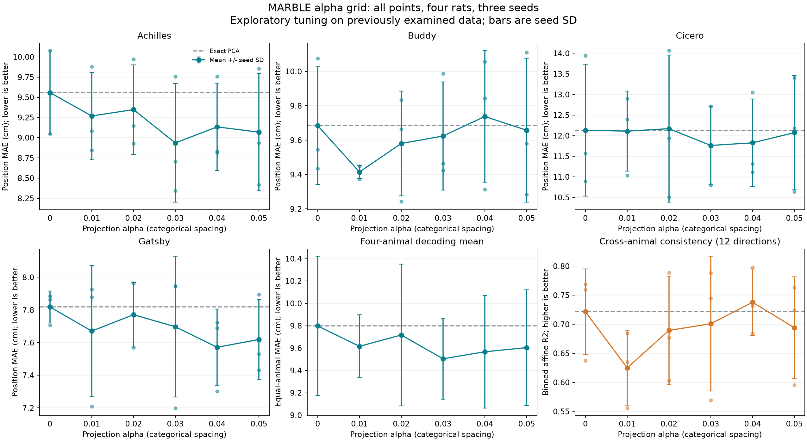

# MARBLE α 网格搜索结果

这是一轮探索性调参：四只大鼠的评估数据此前已查看，最优分数不能视为独立泛化证据。

α 是本项目“状态＋增量联合投影”的权重：α=0 对应精确 PCA，α 越大越强调保留神经状态增量。其余设置固定。解码使用 20 维投影、32 维输出；一致性使用 10 维投影、3 维输出。

位置解码的共同最优 α=0.03，四动物平均 MAE 为 **9.5046 cm**，PCA 为 9.7984 cm（变化 -3.00%；4/4 动物均值改善，8/12 个配对种子改善）。
跨个体一致性的最优 α=0.04，平均 R² 为 **0.7378**，PCA 为 0.7216（差值 +0.0162）。

48 组条件、144 个训练种子：复用 72 个种子，新增 72 个种子，每个种子训练 100 epochs。固定维数、网络及其他超参数，只改变联合投影 α。

## 所有网格点

MAE 单位 cm，↓更好；一致性 R²，↑更好。动物单元格为三种子均值±样本标准差。

| α | Achilles | Buddy | Cicero | Gatsby | 四动物 MAE 均值 | 一致性 R² |
|---|---|---|---|---|---|---|
| 0 | 9.559 ± 0.514 | 9.685 ± 0.342 | 12.132 ± 1.602 | 7.818 ± 0.098 | 9.798 | 0.7216 ± 0.0734 |
| 0.01 | 9.269 ± 0.540 | 9.415 ± 0.038 | 12.109 ± 0.969 | 7.671 ± 0.401 | 9.616 | 0.6250 ± 0.0646 |
| 0.02 | 9.348 ± 0.552 | 9.581 ± 0.304 | 12.169 ± 1.787 | 7.771 ± 0.197 | 9.717 | 0.6894 ± 0.0936 |
| 0.03 | 8.935 ± 0.735 | 9.624 ± 0.314 | 11.762 ± 0.954 | 7.697 ± 0.431 | 9.505 | 0.7008 ± 0.1159 |
| 0.04 | 9.134 ± 0.540 | 9.738 ± 0.383 | 11.825 ± 1.064 | 7.571 ± 0.234 | 9.567 | 0.7378 ± 0.0574 |
| 0.05 | 9.069 ± 0.727 | 9.658 ± 0.419 | 12.072 ± 1.388 | 7.619 ± 0.244 | 9.604 | 0.6941 ± 0.0878 |

两个最优参数分别按各自的预先定义指标选择；不在事后把两个指标合成新的分数。逐只动物选择 α 的最小值，仅反映在这些数据上的调参空间。

## 每只动物的最优值与留一动物选择诊断

| 动物 | 该动物自身最优 α | 自身最优 MAE | 其余三只选择的 α | 留出动物 MAE | PCA MAE |
|---|---|---|---|---|---|
| achilles | 0.03 | 8.9353 | 0.03 | 8.9353 | 9.5586 |
| buddy | 0.01 | 9.4148 | 0.03 | 9.6239 | 9.6848 |
| cicero | 0.03 | 11.7624 | 0.03 | 11.7624 | 12.1319 |
| gatsby | 0.04 | 7.5713 | 0.03 | 7.6969 | 7.8184 |

留一动物选择的平均 MAE：9.5046 cm；PCA：9.7984 cm。选择 α 时不使用被留出动物的网格分数，但这是已研究数据上的回顾性诊断，不是新增独立动物验证。

## 每个种子的解码结果

主指标使用 eval（冻结 BN）；notebook 模式为次要敏感性分析，不按结果切换主指标。

| 动物 | α | 模式 | 种子 | MAE cm | 位置 R² | 最优 epoch |
|---|---|---|---|---|---|---|
| achilles | 0 | eval | 0 | 9.54980 | 0.89173 | 23 |
| achilles | 0 | notebook | 0 | 9.05427 | 0.90343 | 23 |
| achilles | 0 | eval | 1 | 10.07651 | 0.87849 | 59 |
| achilles | 0 | notebook | 1 | 9.13907 | 0.89887 | 59 |
| achilles | 0 | eval | 2 | 9.04951 | 0.89635 | 74 |
| achilles | 0 | notebook | 2 | 8.62418 | 0.91081 | 74 |
| buddy | 0 | eval | 0 | 9.43457 | 0.94377 | 57 |
| buddy | 0 | notebook | 0 | 11.06491 | 0.92467 | 57 |
| buddy | 0 | eval | 1 | 10.07491 | 0.93234 | 76 |
| buddy | 0 | notebook | 1 | 9.71766 | 0.94381 | 76 |
| buddy | 0 | eval | 2 | 9.54492 | 0.94276 | 16 |
| buddy | 0 | notebook | 2 | 10.66948 | 0.92270 | 16 |
| cicero | 0 | eval | 0 | 11.56465 | 0.85313 | 95 |
| cicero | 0 | notebook | 0 | 16.36664 | 0.72881 | 95 |
| cicero | 0 | eval | 1 | 13.93995 | 0.78589 | 66 |
| cicero | 0 | notebook | 1 | 20.52552 | 0.60691 | 66 |
| cicero | 0 | eval | 2 | 10.89105 | 0.88755 | 96 |
| cicero | 0 | notebook | 2 | 14.41309 | 0.81032 | 96 |
| gatsby | 0 | eval | 0 | 7.86332 | 0.90006 | 44 |
| gatsby | 0 | notebook | 0 | 11.04503 | 0.74076 | 44 |
| gatsby | 0 | eval | 1 | 7.88532 | 0.88392 | 27 |
| gatsby | 0 | notebook | 1 | 10.49273 | 0.75757 | 27 |
| gatsby | 0 | eval | 2 | 7.70644 | 0.89006 | 53 |
| gatsby | 0 | notebook | 2 | 11.44809 | 0.72979 | 53 |
| achilles | 0.01 | eval | 0 | 9.08388 | 0.89263 | 23 |
| achilles | 0.01 | notebook | 0 | 8.89990 | 0.90733 | 23 |
| achilles | 0.01 | eval | 1 | 9.87681 | 0.88210 | 59 |
| achilles | 0.01 | notebook | 1 | 9.09654 | 0.89086 | 59 |
| achilles | 0.01 | eval | 2 | 8.84501 | 0.90899 | 74 |
| achilles | 0.01 | notebook | 2 | 8.79483 | 0.91333 | 74 |
| buddy | 0.01 | eval | 0 | 9.41982 | 0.94343 | 57 |
| buddy | 0.01 | notebook | 0 | 11.44395 | 0.91235 | 57 |
| buddy | 0.01 | eval | 1 | 9.37463 | 0.94673 | 76 |
| buddy | 0.01 | notebook | 1 | 9.97354 | 0.94070 | 76 |
| buddy | 0.01 | eval | 2 | 9.44987 | 0.94216 | 16 |
| buddy | 0.01 | notebook | 2 | 10.71478 | 0.91955 | 16 |
| cicero | 0.01 | eval | 0 | 12.40076 | 0.84288 | 54 |
| cicero | 0.01 | notebook | 0 | 16.16461 | 0.73900 | 54 |
| cicero | 0.01 | eval | 1 | 12.89917 | 0.80891 | 66 |
| cicero | 0.01 | notebook | 1 | 19.82623 | 0.61572 | 66 |
| cicero | 0.01 | eval | 2 | 11.02746 | 0.88060 | 96 |
| cicero | 0.01 | notebook | 2 | 13.83284 | 0.81767 | 96 |
| gatsby | 0.01 | eval | 0 | 7.92542 | 0.89731 | 44 |
| gatsby | 0.01 | notebook | 0 | 11.05229 | 0.75059 | 44 |
| gatsby | 0.01 | eval | 1 | 7.20801 | 0.92540 | 63 |
| gatsby | 0.01 | notebook | 1 | 10.04706 | 0.77155 | 63 |
| gatsby | 0.01 | eval | 2 | 7.87847 | 0.89279 | 53 |
| gatsby | 0.01 | notebook | 2 | 11.11710 | 0.75200 | 53 |
| achilles | 0.02 | eval | 0 | 9.14490 | 0.89620 | 23 |
| achilles | 0.02 | notebook | 0 | 9.12709 | 0.89405 | 23 |
| achilles | 0.02 | eval | 1 | 9.97304 | 0.87367 | 59 |
| achilles | 0.02 | notebook | 1 | 8.90943 | 0.90668 | 59 |
| achilles | 0.02 | eval | 2 | 8.92553 | 0.90517 | 74 |
| achilles | 0.02 | notebook | 2 | 8.75546 | 0.90322 | 74 |
| buddy | 0.02 | eval | 0 | 9.24310 | 0.94513 | 54 |
| buddy | 0.02 | notebook | 0 | 11.76787 | 0.89664 | 54 |
| buddy | 0.02 | eval | 1 | 9.83372 | 0.93761 | 75 |
| buddy | 0.02 | notebook | 1 | 9.60838 | 0.94435 | 75 |
| buddy | 0.02 | eval | 2 | 9.66510 | 0.93798 | 16 |
| buddy | 0.02 | notebook | 2 | 10.14082 | 0.93418 | 16 |
| cicero | 0.02 | eval | 0 | 11.93306 | 0.85300 | 54 |
| cicero | 0.02 | notebook | 0 | 16.72357 | 0.72443 | 54 |
| cicero | 0.02 | eval | 1 | 14.06300 | 0.77424 | 66 |
| cicero | 0.02 | notebook | 1 | 21.66477 | 0.54180 | 66 |
| cicero | 0.02 | eval | 2 | 10.51155 | 0.88892 | 96 |
| cicero | 0.02 | notebook | 2 | 14.41733 | 0.79580 | 96 |
| gatsby | 0.02 | eval | 0 | 7.96371 | 0.89710 | 44 |
| gatsby | 0.02 | notebook | 0 | 11.07003 | 0.76217 | 44 |
| gatsby | 0.02 | eval | 1 | 7.77875 | 0.89526 | 27 |
| gatsby | 0.02 | notebook | 1 | 10.02020 | 0.78121 | 27 |
| gatsby | 0.02 | eval | 2 | 7.56945 | 0.91089 | 53 |
| gatsby | 0.02 | notebook | 2 | 9.96063 | 0.80900 | 53 |
| achilles | 0.03 | eval | 0 | 8.34481 | 0.91263 | 23 |
| achilles | 0.03 | notebook | 0 | 8.27592 | 0.93095 | 23 |
| achilles | 0.03 | eval | 1 | 9.75777 | 0.87954 | 59 |
| achilles | 0.03 | notebook | 1 | 9.03982 | 0.88836 | 59 |
| achilles | 0.03 | eval | 2 | 8.70321 | 0.90487 | 74 |
| achilles | 0.03 | notebook | 2 | 8.46428 | 0.90806 | 74 |
| buddy | 0.03 | eval | 0 | 9.46335 | 0.94357 | 57 |
| buddy | 0.03 | notebook | 0 | 11.71294 | 0.89741 | 57 |
| buddy | 0.03 | eval | 1 | 9.98583 | 0.93688 | 76 |
| buddy | 0.03 | notebook | 1 | 10.00208 | 0.94161 | 76 |
| buddy | 0.03 | eval | 2 | 9.42259 | 0.94255 | 16 |
| buddy | 0.03 | notebook | 2 | 10.69045 | 0.92661 | 16 |
| cicero | 0.03 | eval | 0 | 11.77570 | 0.87442 | 70 |
| cicero | 0.03 | notebook | 0 | 16.68862 | 0.73645 | 70 |
| cicero | 0.03 | eval | 1 | 12.70985 | 0.81394 | 66 |
| cicero | 0.03 | notebook | 1 | 18.34020 | 0.65403 | 66 |
| cicero | 0.03 | eval | 2 | 10.80173 | 0.88143 | 96 |
| cicero | 0.03 | notebook | 2 | 14.96599 | 0.78720 | 96 |
| gatsby | 0.03 | eval | 0 | 7.94704 | 0.89403 | 44 |
| gatsby | 0.03 | notebook | 0 | 10.77902 | 0.76329 | 44 |
| gatsby | 0.03 | eval | 1 | 7.19943 | 0.92925 | 63 |
| gatsby | 0.03 | notebook | 1 | 9.50365 | 0.80626 | 63 |
| gatsby | 0.03 | eval | 2 | 7.94432 | 0.88728 | 53 |
| gatsby | 0.03 | notebook | 2 | 11.53409 | 0.72441 | 53 |
| achilles | 0.04 | eval | 0 | 8.83226 | 0.90611 | 23 |
| achilles | 0.04 | notebook | 0 | 8.86609 | 0.90436 | 23 |
| achilles | 0.04 | eval | 1 | 9.75713 | 0.87602 | 59 |
| achilles | 0.04 | notebook | 1 | 9.15135 | 0.88641 | 59 |
| achilles | 0.04 | eval | 2 | 8.81158 | 0.90809 | 74 |
| achilles | 0.04 | notebook | 2 | 8.59621 | 0.90563 | 74 |
| buddy | 0.04 | eval | 0 | 9.31329 | 0.94436 | 57 |
| buddy | 0.04 | notebook | 0 | 11.54286 | 0.90611 | 57 |
| buddy | 0.04 | eval | 1 | 10.05656 | 0.93465 | 76 |
| buddy | 0.04 | notebook | 1 | 10.19795 | 0.93605 | 76 |
| buddy | 0.04 | eval | 2 | 9.84271 | 0.93031 | 16 |
| buddy | 0.04 | notebook | 2 | 10.96743 | 0.91947 | 16 |
| cicero | 0.04 | eval | 0 | 11.31368 | 0.87074 | 95 |
| cicero | 0.04 | notebook | 0 | 16.67844 | 0.71389 | 95 |
| cicero | 0.04 | eval | 1 | 13.04812 | 0.81220 | 66 |
| cicero | 0.04 | notebook | 1 | 20.23572 | 0.59445 | 66 |
| cicero | 0.04 | eval | 2 | 11.11446 | 0.87910 | 96 |
| cicero | 0.04 | notebook | 2 | 15.81993 | 0.76351 | 96 |
| gatsby | 0.04 | eval | 0 | 7.30185 | 0.92905 | 44 |
| gatsby | 0.04 | notebook | 0 | 10.99666 | 0.76497 | 44 |
| gatsby | 0.04 | eval | 1 | 7.68934 | 0.90141 | 63 |
| gatsby | 0.04 | notebook | 1 | 9.91322 | 0.77698 | 63 |
| gatsby | 0.04 | eval | 2 | 7.72270 | 0.89639 | 53 |
| gatsby | 0.04 | notebook | 2 | 10.01874 | 0.79465 | 53 |
| achilles | 0.05 | eval | 0 | 8.41939 | 0.91239 | 23 |
| achilles | 0.05 | notebook | 0 | 8.73656 | 0.91508 | 23 |
| achilles | 0.05 | eval | 1 | 9.85368 | 0.87471 | 59 |
| achilles | 0.05 | notebook | 1 | 9.23220 | 0.88109 | 59 |
| achilles | 0.05 | eval | 2 | 8.93302 | 0.90754 | 74 |
| achilles | 0.05 | notebook | 2 | 8.84182 | 0.89602 | 74 |
| buddy | 0.05 | eval | 0 | 9.28375 | 0.94499 | 57 |
| buddy | 0.05 | notebook | 0 | 11.05908 | 0.91838 | 57 |
| buddy | 0.05 | eval | 1 | 10.11041 | 0.93380 | 76 |
| buddy | 0.05 | notebook | 1 | 9.84326 | 0.94139 | 76 |
| buddy | 0.05 | eval | 2 | 9.57889 | 0.93464 | 16 |
| buddy | 0.05 | notebook | 2 | 10.66811 | 0.92569 | 16 |
| cicero | 0.05 | eval | 0 | 12.17439 | 0.84533 | 54 |
| cicero | 0.05 | notebook | 0 | 17.63881 | 0.68937 | 54 |
| cicero | 0.05 | eval | 1 | 13.40653 | 0.78418 | 66 |
| cicero | 0.05 | notebook | 1 | 21.08081 | 0.58149 | 66 |
| cicero | 0.05 | eval | 2 | 10.63560 | 0.89037 | 96 |
| cicero | 0.05 | notebook | 2 | 15.13764 | 0.77616 | 96 |
| gatsby | 0.05 | eval | 0 | 7.53088 | 0.90804 | 44 |
| gatsby | 0.05 | notebook | 0 | 11.61231 | 0.72232 | 44 |
| gatsby | 0.05 | eval | 1 | 7.43072 | 0.91851 | 63 |
| gatsby | 0.05 | notebook | 1 | 9.62495 | 0.78045 | 63 |
| gatsby | 0.05 | eval | 2 | 7.89520 | 0.89275 | 53 |
| gatsby | 0.05 | notebook | 2 | 10.39315 | 0.77948 | 53 |

## 每个种子的跨个体一致性

| α | 种子 | 12 个方向平均 R² |
|---|---|---|
| 0 | 0 | 0.768535 |
| 0 | 1 | 0.637097 |
| 0 | 2 | 0.759302 |
| 0.01 | 0 | 0.635013 |
| 0.01 | 1 | 0.684005 |
| 0.01 | 2 | 0.555897 |
| 0.02 | 0 | 0.676484 |
| 0.02 | 1 | 0.788723 |
| 0.02 | 2 | 0.602901 |
| 0.03 | 0 | 0.744679 |
| 0.03 | 1 | 0.788418 |
| 0.03 | 2 | 0.569436 |
| 0.04 | 0 | 0.731332 |
| 0.04 | 1 | 0.798145 |
| 0.04 | 2 | 0.683925 |
| 0.05 | 0 | 0.723966 |
| 0.05 | 1 | 0.763037 |
| 0.05 | 2 | 0.595227 |

## 各方向的三种子均值

| 来源 → 目标 | α=0 | α=0.01 | α=0.02 | α=0.03 | α=0.04 | α=0.05 |
|---|---|---|---|---|---|---|
| achilles → buddy | 0.75320 | 0.61271 | 0.72516 | 0.77806 | 0.80062 | 0.79743 |
| achilles → cicero | 0.63305 | 0.45294 | 0.62636 | 0.61287 | 0.64048 | 0.57231 |
| achilles → gatsby | 0.76368 | 0.74848 | 0.83531 | 0.77953 | 0.82656 | 0.78594 |
| buddy → achilles | 0.70829 | 0.57831 | 0.76954 | 0.80865 | 0.85602 | 0.83073 |
| buddy → cicero | 0.64406 | 0.50234 | 0.54756 | 0.58178 | 0.61578 | 0.59894 |
| buddy → gatsby | 0.74893 | 0.63161 | 0.65794 | 0.67923 | 0.74534 | 0.75198 |
| cicero → achilles | 0.71398 | 0.55810 | 0.72703 | 0.73361 | 0.76934 | 0.62952 |
| cicero → buddy | 0.78744 | 0.69337 | 0.63568 | 0.67004 | 0.72065 | 0.66724 |
| cicero → gatsby | 0.73163 | 0.63768 | 0.69030 | 0.68715 | 0.71262 | 0.64352 |
| gatsby → achilles | 0.76091 | 0.78958 | 0.85108 | 0.83914 | 0.85261 | 0.82523 |
| gatsby → buddy | 0.76760 | 0.73438 | 0.64764 | 0.66703 | 0.72323 | 0.72195 |
| gatsby → cicero | 0.64695 | 0.56015 | 0.55883 | 0.57304 | 0.59036 | 0.50412 |

## 核查与边界

- 每组均完成原始 CPU 实现的数值核对和训练后模型审计；保存各组原始采样计划，初始权重和节点划分配对一致，邻接图及邻域随 α 重新计算。
- 沿用已修订的一致性校验：同起点 float32 单步核对及完整 float64 轨迹核对；全部 24 组通过。正式训练仍为 float32。不宣称完整 float32 轨迹一致，详见 [数值验证背景](NUMERICS.md)。
- 18 组一致性计算通过 CEBRA 0.4.0 / sklearn 1.3.2 独立核查，最大 R² 差异 1.66e-07。
- 一致性采用行为位置分箱后的同样本仿射回归 R²，不是零样本迁移或留出行为解码。
- 表征训练不输入行为标签；本轮用行为解码及位置对齐指标选 α，因此参数选择使用了行为标签。
- 种子和 12 个动物对不是独立生物学重复；这里报告描述统计，不声明显著性。
- α=0.05 是本轮上边界；离散局部网格不证明全局最优。
- 只覆盖公开四大鼠子集及 checkpoint/notebook 协议，不代表论文全部实验。
- 原始代码审计中的浮点距离并列近邻差异若存在，完整保存在 audits.json；不能称逐位完全一致。

Material Passport: academic-research-suite / experiment-agent; mode validate; origin 2026-09-30; status ANALYZED (all grid runs executed and audited, descriptive inference only).

Large artifacts: `D:\MARBLE-experiments\KAIR\alpha-fine-grid-20260930`. Execution and analysis source snapshots accompany this report.
