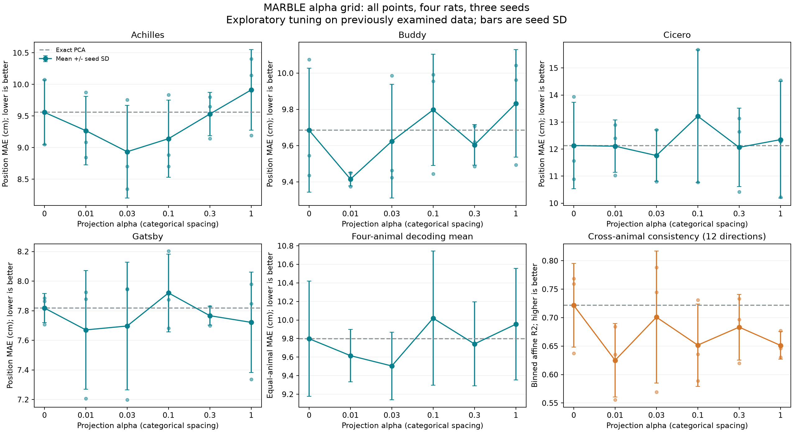

# MARBLE α 网格搜索结果

这是一轮探索性调参：四只大鼠的评估数据此前已查看，最优分数不能视为独立泛化证据。

α 是本项目“状态＋增量联合投影”的权重：α=0 对应精确 PCA，α 越大越强调保留神经状态增量。其余设置固定。解码使用 20 维投影、32 维输出；一致性使用 10 维投影、3 维输出。

位置解码的共同最优 α=0.03，四动物平均 MAE 为 **9.5046 cm**，PCA 为 9.7984 cm（变化 -3.00%；4/4 动物均值改善，8/12 个配对种子改善）。
跨个体一致性的最优 α=0，平均 R² 为 **0.7216**，PCA 为 0.7216（差值 +0.0000）。

48 组条件、144 个训练种子：复用已审计的 17 组/51 个种子，新增 31 组/93 个种子，每个种子训练 100 epochs。固定维数、网络及其他超参数，只改变联合投影 α。

## 所有网格点

MAE 单位 cm，↓更好；一致性 R²，↑更好。动物单元格为三种子均值±样本标准差。

| α | Achilles | Buddy | Cicero | Gatsby | 四动物 MAE 均值 | 一致性 R² |
|---|---|---|---|---|---|---|
| 0 | 9.559 ± 0.514 | 9.685 ± 0.342 | 12.132 ± 1.602 | 7.818 ± 0.098 | 9.798 | 0.7216 ± 0.0734 |
| 0.01 | 9.269 ± 0.540 | 9.415 ± 0.038 | 12.109 ± 0.969 | 7.671 ± 0.401 | 9.616 | 0.6250 ± 0.0646 |
| 0.03 | 8.935 ± 0.735 | 9.624 ± 0.314 | 11.762 ± 0.954 | 7.697 ± 0.431 | 9.505 | 0.7008 ± 0.1159 |
| 0.1 | 9.142 ± 0.609 | 9.797 ± 0.307 | 13.218 ± 2.451 | 7.920 ± 0.263 | 10.019 | 0.6517 ± 0.0724 |
| 0.3 | 9.532 ± 0.344 | 9.604 ± 0.112 | 12.066 ± 1.447 | 7.767 ± 0.064 | 9.742 | 0.6833 ± 0.0577 |
| 1 | 9.914 ± 0.637 | 9.833 ± 0.297 | 12.351 ± 2.163 | 7.721 ± 0.339 | 9.955 | 0.6512 ± 0.0240 |

两个最优参数分别按各自的预先定义指标选择；不在事后把两个指标合成新的分数。逐只动物选择 α 的最小值，仅反映在这些数据上的调参空间。

## 每只动物的最优值与留一动物选择诊断

| 动物 | 该动物自身最优 α | 自身最优 MAE | 其余三只选择的 α | 留出动物 MAE | PCA MAE |
|---|---|---|---|---|---|
| achilles | 0.03 | 8.9353 | 0.03 | 8.9353 | 9.5586 |
| buddy | 0.01 | 9.4148 | 0.03 | 9.6239 | 9.6848 |
| cicero | 0.03 | 11.7624 | 0.03 | 11.7624 | 12.1319 |
| gatsby | 0.01 | 7.6706 | 0.03 | 7.6969 | 7.8184 |

留一动物选择的平均 MAE：9.5046 cm；PCA：9.7984 cm。选择 α 时不使用被留出动物的网格分数，但这是已研究数据上的回顾性诊断，不是新增独立动物验证。

## 每个种子的解码结果

主指标使用 eval（冻结 BN）；notebook 模式为次要敏感性分析，不按结果切换主指标。

| 动物 | α | 模式 | 种子 | MAE cm | 位置 R² | 最优 epoch |
|---|---|---|---|---|---|---|
| achilles | 0 | eval | 0 | 9.54980 | 0.89173 | 23 |
| achilles | 0 | notebook | 0 | 9.05427 | 0.90343 | 23 |
| achilles | 0 | eval | 1 | 10.07651 | 0.87849 | 59 |
| achilles | 0 | notebook | 1 | 9.13907 | 0.89887 | 59 |
| achilles | 0 | eval | 2 | 9.04951 | 0.89635 | 74 |
| achilles | 0 | notebook | 2 | 8.62418 | 0.91081 | 74 |
| buddy | 0 | eval | 0 | 9.43457 | 0.94377 | 57 |
| buddy | 0 | notebook | 0 | 11.06491 | 0.92467 | 57 |
| buddy | 0 | eval | 1 | 10.07491 | 0.93234 | 76 |
| buddy | 0 | notebook | 1 | 9.71766 | 0.94381 | 76 |
| buddy | 0 | eval | 2 | 9.54492 | 0.94276 | 16 |
| buddy | 0 | notebook | 2 | 10.66948 | 0.92270 | 16 |
| cicero | 0 | eval | 0 | 11.56465 | 0.85313 | 95 |
| cicero | 0 | notebook | 0 | 16.36664 | 0.72881 | 95 |
| cicero | 0 | eval | 1 | 13.93995 | 0.78589 | 66 |
| cicero | 0 | notebook | 1 | 20.52552 | 0.60691 | 66 |
| cicero | 0 | eval | 2 | 10.89105 | 0.88755 | 96 |
| cicero | 0 | notebook | 2 | 14.41309 | 0.81032 | 96 |
| gatsby | 0 | eval | 0 | 7.86332 | 0.90006 | 44 |
| gatsby | 0 | notebook | 0 | 11.04503 | 0.74076 | 44 |
| gatsby | 0 | eval | 1 | 7.88532 | 0.88392 | 27 |
| gatsby | 0 | notebook | 1 | 10.49273 | 0.75757 | 27 |
| gatsby | 0 | eval | 2 | 7.70644 | 0.89006 | 53 |
| gatsby | 0 | notebook | 2 | 11.44809 | 0.72979 | 53 |
| achilles | 0.01 | eval | 0 | 9.08388 | 0.89263 | 23 |
| achilles | 0.01 | notebook | 0 | 8.89990 | 0.90733 | 23 |
| achilles | 0.01 | eval | 1 | 9.87681 | 0.88210 | 59 |
| achilles | 0.01 | notebook | 1 | 9.09654 | 0.89086 | 59 |
| achilles | 0.01 | eval | 2 | 8.84501 | 0.90899 | 74 |
| achilles | 0.01 | notebook | 2 | 8.79483 | 0.91333 | 74 |
| buddy | 0.01 | eval | 0 | 9.41982 | 0.94343 | 57 |
| buddy | 0.01 | notebook | 0 | 11.44395 | 0.91235 | 57 |
| buddy | 0.01 | eval | 1 | 9.37463 | 0.94673 | 76 |
| buddy | 0.01 | notebook | 1 | 9.97354 | 0.94070 | 76 |
| buddy | 0.01 | eval | 2 | 9.44987 | 0.94216 | 16 |
| buddy | 0.01 | notebook | 2 | 10.71478 | 0.91955 | 16 |
| cicero | 0.01 | eval | 0 | 12.40076 | 0.84288 | 54 |
| cicero | 0.01 | notebook | 0 | 16.16461 | 0.73900 | 54 |
| cicero | 0.01 | eval | 1 | 12.89917 | 0.80891 | 66 |
| cicero | 0.01 | notebook | 1 | 19.82623 | 0.61572 | 66 |
| cicero | 0.01 | eval | 2 | 11.02746 | 0.88060 | 96 |
| cicero | 0.01 | notebook | 2 | 13.83284 | 0.81767 | 96 |
| gatsby | 0.01 | eval | 0 | 7.92542 | 0.89731 | 44 |
| gatsby | 0.01 | notebook | 0 | 11.05229 | 0.75059 | 44 |
| gatsby | 0.01 | eval | 1 | 7.20801 | 0.92540 | 63 |
| gatsby | 0.01 | notebook | 1 | 10.04706 | 0.77155 | 63 |
| gatsby | 0.01 | eval | 2 | 7.87847 | 0.89279 | 53 |
| gatsby | 0.01 | notebook | 2 | 11.11710 | 0.75200 | 53 |
| achilles | 0.03 | eval | 0 | 8.34481 | 0.91263 | 23 |
| achilles | 0.03 | notebook | 0 | 8.27592 | 0.93095 | 23 |
| achilles | 0.03 | eval | 1 | 9.75777 | 0.87954 | 59 |
| achilles | 0.03 | notebook | 1 | 9.03982 | 0.88836 | 59 |
| achilles | 0.03 | eval | 2 | 8.70321 | 0.90487 | 74 |
| achilles | 0.03 | notebook | 2 | 8.46428 | 0.90806 | 74 |
| buddy | 0.03 | eval | 0 | 9.46335 | 0.94357 | 57 |
| buddy | 0.03 | notebook | 0 | 11.71294 | 0.89741 | 57 |
| buddy | 0.03 | eval | 1 | 9.98583 | 0.93688 | 76 |
| buddy | 0.03 | notebook | 1 | 10.00208 | 0.94161 | 76 |
| buddy | 0.03 | eval | 2 | 9.42259 | 0.94255 | 16 |
| buddy | 0.03 | notebook | 2 | 10.69045 | 0.92661 | 16 |
| cicero | 0.03 | eval | 0 | 11.77570 | 0.87442 | 70 |
| cicero | 0.03 | notebook | 0 | 16.68862 | 0.73645 | 70 |
| cicero | 0.03 | eval | 1 | 12.70985 | 0.81394 | 66 |
| cicero | 0.03 | notebook | 1 | 18.34020 | 0.65403 | 66 |
| cicero | 0.03 | eval | 2 | 10.80173 | 0.88143 | 96 |
| cicero | 0.03 | notebook | 2 | 14.96599 | 0.78720 | 96 |
| gatsby | 0.03 | eval | 0 | 7.94704 | 0.89403 | 44 |
| gatsby | 0.03 | notebook | 0 | 10.77902 | 0.76329 | 44 |
| gatsby | 0.03 | eval | 1 | 7.19943 | 0.92925 | 63 |
| gatsby | 0.03 | notebook | 1 | 9.50365 | 0.80626 | 63 |
| gatsby | 0.03 | eval | 2 | 7.94432 | 0.88728 | 53 |
| gatsby | 0.03 | notebook | 2 | 11.53409 | 0.72441 | 53 |
| achilles | 0.1 | eval | 0 | 8.70228 | 0.90186 | 23 |
| achilles | 0.1 | notebook | 0 | 9.04642 | 0.90800 | 23 |
| achilles | 0.1 | eval | 1 | 9.83616 | 0.88013 | 59 |
| achilles | 0.1 | notebook | 1 | 9.13469 | 0.88022 | 59 |
| achilles | 0.1 | eval | 2 | 8.88640 | 0.91401 | 74 |
| achilles | 0.1 | notebook | 2 | 8.22036 | 0.91408 | 74 |
| buddy | 0.1 | eval | 0 | 9.44384 | 0.94540 | 54 |
| buddy | 0.1 | notebook | 0 | 10.75617 | 0.93077 | 54 |
| buddy | 0.1 | eval | 1 | 9.95576 | 0.93526 | 76 |
| buddy | 0.1 | notebook | 1 | 9.92265 | 0.93898 | 76 |
| buddy | 0.1 | eval | 2 | 9.99229 | 0.93148 | 16 |
| buddy | 0.1 | notebook | 2 | 10.79094 | 0.92306 | 16 |
| cicero | 0.1 | eval | 0 | 13.20213 | 0.81763 | 54 |
| cicero | 0.1 | notebook | 0 | 18.05687 | 0.67028 | 54 |
| cicero | 0.1 | eval | 1 | 15.67736 | 0.73049 | 66 |
| cicero | 0.1 | notebook | 1 | 24.07033 | 0.47813 | 66 |
| cicero | 0.1 | eval | 2 | 10.77584 | 0.88872 | 96 |
| cicero | 0.1 | notebook | 2 | 15.21368 | 0.77552 | 96 |
| gatsby | 0.1 | eval | 0 | 7.68289 | 0.91036 | 44 |
| gatsby | 0.1 | notebook | 0 | 11.22045 | 0.74090 | 44 |
| gatsby | 0.1 | eval | 1 | 7.87572 | 0.89311 | 27 |
| gatsby | 0.1 | notebook | 1 | 10.41615 | 0.76863 | 27 |
| gatsby | 0.1 | eval | 2 | 8.20235 | 0.88873 | 53 |
| gatsby | 0.1 | notebook | 2 | 10.57812 | 0.77109 | 53 |
| achilles | 0.3 | eval | 0 | 9.64963 | 0.88986 | 23 |
| achilles | 0.3 | notebook | 0 | 9.87898 | 0.88167 | 23 |
| achilles | 0.3 | eval | 1 | 9.80214 | 0.88216 | 59 |
| achilles | 0.3 | notebook | 1 | 8.68097 | 0.89240 | 59 |
| achilles | 0.3 | eval | 2 | 9.14426 | 0.89803 | 74 |
| achilles | 0.3 | notebook | 2 | 9.06470 | 0.90209 | 74 |
| buddy | 0.3 | eval | 0 | 9.48426 | 0.94194 | 54 |
| buddy | 0.3 | notebook | 0 | 11.82826 | 0.90008 | 54 |
| buddy | 0.3 | eval | 1 | 9.70741 | 0.94063 | 76 |
| buddy | 0.3 | notebook | 1 | 10.03404 | 0.93838 | 76 |
| buddy | 0.3 | eval | 2 | 9.61962 | 0.93565 | 16 |
| buddy | 0.3 | notebook | 2 | 10.85924 | 0.91912 | 16 |
| cicero | 0.3 | eval | 0 | 12.64497 | 0.84545 | 54 |
| cicero | 0.3 | notebook | 0 | 17.68174 | 0.69123 | 54 |
| cicero | 0.3 | eval | 1 | 13.13299 | 0.80420 | 66 |
| cicero | 0.3 | notebook | 1 | 22.58904 | 0.52137 | 66 |
| cicero | 0.3 | eval | 2 | 10.41878 | 0.89939 | 96 |
| cicero | 0.3 | notebook | 2 | 13.60425 | 0.82831 | 96 |
| gatsby | 0.3 | eval | 0 | 7.69924 | 0.91201 | 44 |
| gatsby | 0.3 | notebook | 0 | 10.81170 | 0.76070 | 44 |
| gatsby | 0.3 | eval | 1 | 7.82736 | 0.89765 | 27 |
| gatsby | 0.3 | notebook | 1 | 9.79221 | 0.78289 | 27 |
| gatsby | 0.3 | eval | 2 | 7.77293 | 0.90875 | 53 |
| gatsby | 0.3 | notebook | 2 | 10.83506 | 0.76178 | 53 |
| achilles | 1 | eval | 0 | 10.14268 | 0.89179 | 23 |
| achilles | 1 | notebook | 0 | 10.12885 | 0.87464 | 23 |
| achilles | 1 | eval | 1 | 10.40381 | 0.87528 | 59 |
| achilles | 1 | notebook | 1 | 9.49392 | 0.88109 | 59 |
| achilles | 1 | eval | 2 | 9.19416 | 0.90523 | 74 |
| achilles | 1 | notebook | 2 | 9.13057 | 0.89757 | 74 |
| buddy | 1 | eval | 0 | 9.49319 | 0.94026 | 57 |
| buddy | 1 | notebook | 0 | 11.55626 | 0.91538 | 57 |
| buddy | 1 | eval | 1 | 9.96184 | 0.93382 | 76 |
| buddy | 1 | notebook | 1 | 10.54621 | 0.92530 | 76 |
| buddy | 1 | eval | 2 | 10.04317 | 0.93169 | 16 |
| buddy | 1 | notebook | 2 | 10.67326 | 0.92242 | 16 |
| cicero | 1 | eval | 0 | 12.27752 | 0.84718 | 70 |
| cicero | 1 | notebook | 0 | 17.54260 | 0.70372 | 70 |
| cicero | 1 | eval | 1 | 14.54953 | 0.79207 | 66 |
| cicero | 1 | notebook | 1 | 19.77518 | 0.62051 | 66 |
| cicero | 1 | eval | 2 | 10.22460 | 0.91113 | 96 |
| cicero | 1 | notebook | 2 | 14.09210 | 0.80061 | 96 |
| gatsby | 1 | eval | 0 | 7.84748 | 0.89077 | 44 |
| gatsby | 1 | notebook | 0 | 10.95102 | 0.75406 | 44 |
| gatsby | 1 | eval | 1 | 7.33768 | 0.91769 | 63 |
| gatsby | 1 | notebook | 1 | 9.58962 | 0.80131 | 63 |
| gatsby | 1 | eval | 2 | 7.97929 | 0.89949 | 53 |
| gatsby | 1 | notebook | 2 | 11.14357 | 0.76563 | 53 |

## 每个种子的跨个体一致性

| α | 种子 | 12 个方向平均 R² |
|---|---|---|
| 0 | 0 | 0.768535 |
| 0 | 1 | 0.637097 |
| 0 | 2 | 0.759302 |
| 0.01 | 0 | 0.635013 |
| 0.01 | 1 | 0.684005 |
| 0.01 | 2 | 0.555897 |
| 0.03 | 0 | 0.744679 |
| 0.03 | 1 | 0.788418 |
| 0.03 | 2 | 0.569436 |
| 0.1 | 0 | 0.588713 |
| 0.1 | 1 | 0.730787 |
| 0.1 | 2 | 0.635633 |
| 0.3 | 0 | 0.620074 |
| 0.3 | 1 | 0.696696 |
| 0.3 | 2 | 0.733154 |
| 1 | 0 | 0.646113 |
| 1 | 1 | 0.677359 |
| 1 | 2 | 0.630233 |

## 各方向的三种子均值

| 来源 → 目标 | α=0 | α=0.01 | α=0.03 | α=0.1 | α=0.3 | α=1 |
|---|---|---|---|---|---|---|
| achilles → buddy | 0.75320 | 0.61271 | 0.77806 | 0.60069 | 0.66030 | 0.67672 |
| achilles → cicero | 0.63305 | 0.45294 | 0.61287 | 0.57182 | 0.60646 | 0.56171 |
| achilles → gatsby | 0.76368 | 0.74848 | 0.77953 | 0.74398 | 0.79272 | 0.73163 |
| buddy → achilles | 0.70829 | 0.57831 | 0.80865 | 0.69308 | 0.68733 | 0.61817 |
| buddy → cicero | 0.64406 | 0.50234 | 0.58178 | 0.57781 | 0.63053 | 0.64851 |
| buddy → gatsby | 0.74893 | 0.63161 | 0.67923 | 0.65452 | 0.70093 | 0.65597 |
| cicero → achilles | 0.71398 | 0.55810 | 0.73361 | 0.66757 | 0.66257 | 0.57155 |
| cicero → buddy | 0.78744 | 0.69337 | 0.67004 | 0.62081 | 0.64254 | 0.65985 |
| cicero → gatsby | 0.73163 | 0.63768 | 0.68715 | 0.65475 | 0.68449 | 0.62685 |
| gatsby → achilles | 0.76091 | 0.78958 | 0.83914 | 0.81360 | 0.80090 | 0.77524 |
| gatsby → buddy | 0.76760 | 0.73438 | 0.66703 | 0.65632 | 0.71738 | 0.71557 |
| gatsby → cicero | 0.64695 | 0.56015 | 0.57304 | 0.56559 | 0.61354 | 0.57305 |

## 核查与边界

- 每组均完成原始 CPU 实现的数值核对和训练后模型审计；保存各组原始采样计划，初始权重和节点划分配对一致，邻接图及邻域随 α 重新计算。
- 一致性的原连续 float32 校验曾失败，随后统一采用同起点 float32 单步核对及完整 float64 轨迹核对；全部 24 组通过。正式训练仍为 float32，既有模型补查而不重训。详见 [数值验证修订](NUMERICS.md)。
- 18 组一致性计算通过 CEBRA 0.4.0 / sklearn 1.3.2 独立核查，最大 R² 差异 1.66e-07。
- 一致性采用行为位置分箱后的同样本仿射回归 R²，不是零样本迁移或留出行为解码。
- 表征训练不输入行为标签；本轮用行为解码及位置对齐指标选 α，因此参数选择使用了行为标签。
- 种子和 12 个动物对不是独立生物学重复；这里报告描述统计，不声明显著性。
- α=1 是本轮上边界；若最优值落在边界，不能宣称已找到全局最优。
- 只覆盖公开四大鼠子集及 checkpoint/notebook 协议，不代表论文全部实验。
- 原始代码审计中的浮点距离并列近邻差异若存在，完整保存在 audits.json；不能称逐位完全一致。

Material Passport: academic-research-suite / experiment-agent; mode validate; origin 2026-09-30; status ANALYZED (all grid runs executed and audited, descriptive inference only).

Large artifacts: `D:\MARBLE-experiments\KAIR\alpha-grid-20260930`. Execution and analysis source snapshots accompany this report.
