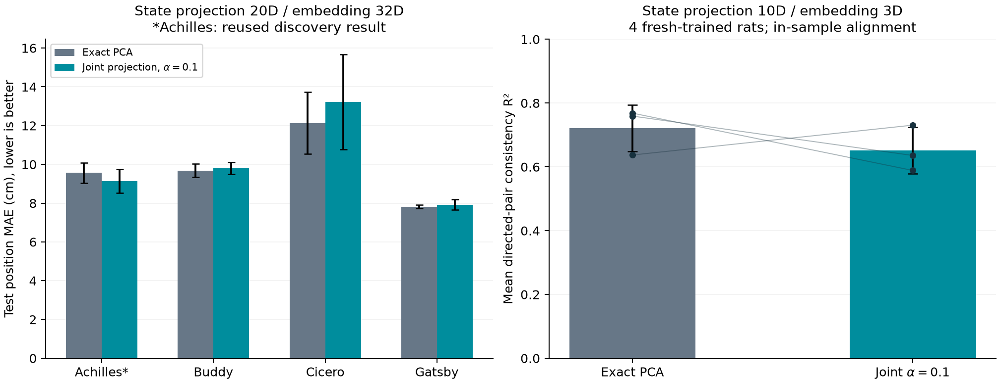

# MARBLE 联合投影：新增动物与跨个体验证

材料性质：固定参数的探索性后续实验；数据为公开大鼠记录；所有结果保留。
这份报告验证新增动物和跨个体协议，尚未覆盖论文的 RNN、猕猴等实验。
采用发布 checkpoint／notebook 衍生协议；论文 PCA=5 等参数设置另列实验，不能用本结果替代。

## 预先固定的比较

- Exact PCA（α=0）与状态–增量联合投影（α=0.1）；α 来自 Achilles 探索，新增动物上不调参。
- 每条件 3 个种子 × 100 epochs；同种子初始权重、节点划分一致；按无监督验证损失选 checkpoint。
- 解码：20 维输入投影、32 维输出，时间上前 80% 训练／后 20% 测试。测试图使用完整测试段，属于离线解码。
- 一致性：10 维输入投影、3 维输出、dropout=0.5，四只动物分别使用全部公开记录从头训练。
- Buddy：6,577×48；Achilles：10,000×120；Cicero：10,000×55；Gatsby：10,000×66。行是时间点，列是神经元。
- 原版 CPU 构图及采样；PyTorch CUDA 13 训练；保持作者平滑、非零 bin 事件转换等预处理约定。

## 1. 单动物位置解码

主指标：冻结 BN 的测试位置 MAE（cm，越低越好）。均值±样本 SD 来自三个训练种子。

| 动物 | PCA | 联合投影 | MAE 相对变化 | 改善种子 |
|---|---:|---:|---:|---:|
| Achilles（探索，复用） | 9.559±0.514 | 9.142±0.609 | -4.36% | 3/3 |
| Buddy（新增） | 9.685±0.342 | 9.797±0.307 | +1.16% | 1/3 |
| Cicero（新增） | 12.132±1.602 | 13.218±2.451 | +8.96% | 1/3 |
| Gatsby（新增） | 7.818±0.098 | 7.920±0.263 | +1.30% | 2/3 |

仅看新增三只动物：0/3 只平均 MAE 改善，4/9 个配对种子改善。等权宏平均 MAE：9.878 → 10.312 cm。

Achilles 用于提出 α 候选，不能再作为独立验证。不得只选最好种子或最好动物。

### 配对种子明细（联合 − PCA，cm；负值为改善）

| 动物 | seed 0 | seed 1 | seed 2 | PCA R²均值 | 联合 R²均值 |
|---|---:|---:|---:|---:|---:|
| achilles | -0.8475 | -0.2403 | -0.1631 | 0.88885 | 0.89867 |
| buddy | +0.0093 | -0.1192 | +0.4474 | 0.93962 | 0.93738 |
| cicero | +1.6375 | +1.7374 | -0.1152 | 0.84219 | 0.81228 |
| gatsby | -0.1804 | -0.0096 | +0.4959 | 0.89135 | 0.89740 |

### Notebook BN 敏感性（次要指标）

| 动物 | PCA MAE/cm | 联合 MAE/cm | 相对变化 |
|---|---:|---:|---:|
| achilles | 8.939±0.276 | 8.800±0.504 | -1.55% |
| buddy | 10.484±0.693 | 10.490±0.492 | +0.06% |
| cicero | 17.102±3.122 | 19.114±4.522 | +11.76% |
| gatsby | 10.995±0.480 | 10.738±0.425 | -2.34% |

## 2. 跨个体表示一致性

每个种子包含 12 个有方向的动物对。先按位置分箱、归一化平均表示，再做带截距线性回归；在相同分箱点拟合并评分。位置标签仅用于评估对齐。该 R² 不是跨个体零样本解码，也不是行为留出集性能。

| 条件 | seed 0 | seed 1 | seed 2 | 均值±SD |
|---|---:|---:|---:|---:|
| pca | 0.768535 | 0.637097 | 0.759302 | 0.721645±0.073366 |
| joint-01 | 0.588713 | 0.730787 | 0.635633 | 0.651711±0.072389 |

补充诊断：仅看 Buddy、Cicero、Gatsby 之间的 6 个方向（保留四动物统一分箱）。该诊断在第一套一致性模型训练前加入；全部 12 个方向仍是预定主指标。

- pca：R²=0.721102±0.005497。
- joint-01：R²=0.621633±0.118393。

以下每格是三个种子的均值；完整逐对、逐种子数值在 `aggregate.json`。

| 方向 | PCA R² | 联合 R² | 差值 |
|---|---:|---:|---:|
| achilles → buddy | 0.753202 | 0.600693 | -0.152509 |
| achilles → cicero | 0.633055 | 0.571821 | -0.061234 |
| achilles → gatsby | 0.763681 | 0.743977 | -0.019704 |
| buddy → achilles | 0.708290 | 0.693077 | -0.015213 |
| buddy → cicero | 0.644061 | 0.577811 | -0.066250 |
| buddy → gatsby | 0.748931 | 0.654517 | -0.094414 |
| cicero → achilles | 0.713983 | 0.667565 | -0.046418 |
| cicero → buddy | 0.787437 | 0.620812 | -0.166626 |
| cicero → gatsby | 0.731627 | 0.654747 | -0.076880 |
| gatsby → achilles | 0.760914 | 0.813603 | +0.052689 |
| gatsby → buddy | 0.767602 | 0.656317 | -0.111285 |
| gatsby → cicero | 0.646954 | 0.565593 | -0.081362 |

## 3. 投影目标检查

以下为拟合段残差能量占比；两种残差分别除以状态能量和增量能量。每行只拟合一次投影，不因三个网络种子而重复计算样本量。

| 协议／动物 | PCA 状态残差 | 联合状态残差 | PCA 增量残差 | 联合增量残差 |
|---|---:|---:|---:|---:|
| decoding/buddy | 2.7978% | 2.8033% | 5.4563% | 5.3396% |
| decoding/cicero | 7.1522% | 7.1608% | 11.9943% | 11.8104% |
| decoding/gatsby | 4.6811% | 4.6882% | 7.7583% | 7.6056% |
| consistency/achilles | 27.1369% | 27.1679% | 38.8475% | 38.1513% |
| consistency/buddy | 11.9974% | 12.0131% | 18.3346% | 18.0144% |
| consistency/cicero | 24.9860% | 25.0061% | 36.3796% | 35.9521% |
| consistency/gatsby | 15.5445% | 15.5721% | 24.0107% | 23.4349% |

## 4. 实现核对与结论边界

- 新增 42 次训练均完成 100 epochs；14 个条件均保存原版三步 SGD 对照及原版 CPU checkpoint 复核。
- 3D 训练前校验采用原版双精度基准：原版单精度与 CUDA 单精度分别按原容差核对；正式训练仍为单精度。
- 解码器对照原版 CEBRA KNNDecoder；如遇边界等距邻居，必须通过独立等距证明，不能放宽整体误差容限。
- 全部跨个体 R² 使用固定版本 CEBRA 0.4.0、scikit-learn 1.3.2 独立复核。
- 三个种子衡量优化波动；12 个有向动物对共享四只动物，不能当作 12 个独立生物样本。
- 增量投影残差降低是该目标的数学性质，不保证行为 MAE 或跨个体一致性改善。
- 跨个体实验均为从头训练；此前作者 checkpoint 的成绩不混入此处。

## 可复核材料

`aggregate.json`：全部指标；`audits.json`：14 条件的实现核对和来源哈希；`cebra_metric_audit.json`：独立一致性度量审计；`frozen_protocol.json`：训练前固定方案；`source.zip`：执行代码快照。原始权重、图、采样和逐 epoch 损失保留在本地结果目录。

结果目录：`D:\MARBLE-experiments\KAIR\dynamics-multirat-20260929-v2`。
